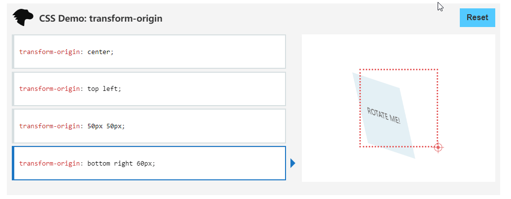

### CSS3的prespective属性和transform-origin

#### prespective属性的定义和用法

CSS属性 prespective 指定了观察者与 z = 0 平面的，使**具有三维位置变换的元素**产生透视效果。z > 0 的三维元素比正常的大，而 z < 0 则比正常的小，大小的程度由该属性的值决定。

用法：
当为元素定义 prespective 属性时，**其子元素会获得透视效果，而不是元素本身**。值得注意的是，**prespective 属性只会影响 3D 转化元素**。

语法：

```css
prespective: <length> | none;

<length> length 指定观察者距离 z = 0 平面的距离
none  默认值。没有应用 prespective 样式时的默认值
```

举例：
```html
<div class="box1">
    <div class="box2">HELLO</div>
</div>
<style>
    .box1{
        display: flex;
        align-items: center;
        justify-content: center;
        width: 200px;
        height: 200px;
        border: 1px solid black;
        perspective: 150;
        -webkit-perspective: 150;
    }
    .box2{
        width: 100px;
        height: 100px;
        background-color: red;
        text-align: center;
        transform: rotateY(45deg);
    }
</style>
```

#### transform-origin属性

transform-origin 属性允许更改转化元素的位置。transform-origin 是变形原点，原点就是元素围绕元素旋转或变形的点。

transform-origin 属性可以是一个参数值，也可以是两个参数值。如果是两个参数值，第一个值设置水平方向 X 轴的位置，第二个值用来设置垂直方向 Y 轴的位置。

语法：

```css
transform-origin: x-axis y-axis z-axis;
```

  
