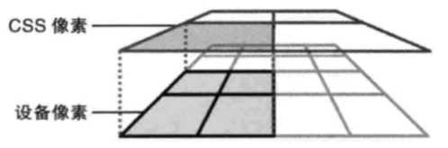
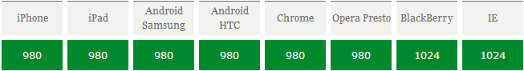
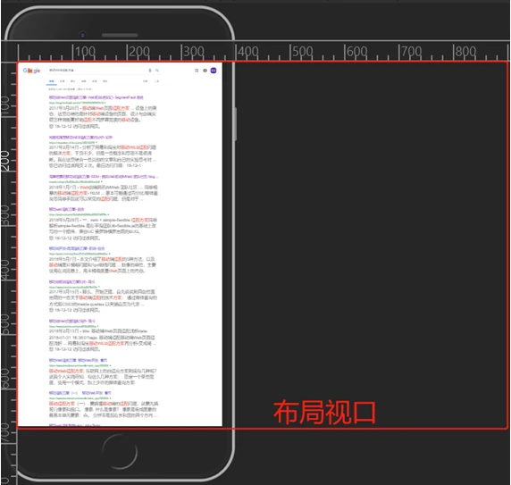

### 移动端适配问题

- [移动端适配问题](#移动端适配问题)
  - [几种概念](#几种概念)
  - [相关问题](#相关问题)
  - [移动端的设备的方案一般时flexible + rem方案](#移动端的设备的方案一般时flexible--rem方案)

#### 几种概念

**像素**

- **设备像素**
  
    设备像素也可以称为物理像素，由设备的屏幕决定，其实就是屏幕中控制显示的最小单位。

- **设备独立像素**
  
    设备独立像素是一种可以被程序所控制的虚拟像素， 在Web开发中对应 CSS 像素

- **DPR（设备像素比）**

    设备像素与设备独立像素之间的关系就是，DPR（设备像素比），设备像素比 = 设备像素 / 设备独立像素。这条公式成立的前提是 ，缩放比为 1 。根据这种关系，如果设备像素大于设备独立像素，就会出现一个设备独立像素对应多个设备像素的情况：


  

如图所示：1 个CSS像素对应了多个设备像素的情况

**视口**

移动端中的三个视口（viewport），布局视口、可视视口、理想视口，是移动端适配的基础。

- **布局视口**
  
    布局视口是在 html 元素之上的容器，我们的页面就“装”在布局视口中。
    如果说 CSS 是一支画笔，那么布局视口就是那张画布。为了容纳为 PC 端设计的网站，移动设备默认的布局视口宽度远大于屏幕的宽度，一般在785px ~ 1024px间。`document.documentElement.clientWidth` 返回的就是布局视口的尺寸。  
    <br>

     

      

- **视觉视口**
  
    视觉视口是指用户通过设备屏幕看到的区域。对应的JavaScript属性是 `docment.innerWidth` 。
    需要注意的是缩放会影响视觉视口的大小。当缩放程度是 100% 时，视觉视口和设备屏幕一样宽。放大使视觉视口变得更小，因为屏幕上显示的 CSS 像素更小了，而缩小会让视觉视口更大，因为屏幕上的 CSS 像素更多了。缩放程度与视觉视口大小是逆相关的：放得越大，视觉视口越小。
    <br>

      

- **理想视口**
  
    默认情况下，一个手机或者平板浏览器的布局宽度是980或1024像素。虽然这能让桌面网站不被压扁，但是这并不理想，尤其是对手机用户，因为在狭窄的屏幕上更适合一个狭窄的网站。

    理想视口是指网站的在移动设备中的理想大小，这个大小就是设备的屏幕大小。**只有当网站是为手机准备的时候才应该使用理想视口**。只有主动地在页面设置 meta 视口标签时理想视口才会生效。

```html
<!-- 告诉浏览器，我想要使用理想视口了 -->
<meta name="viewport" content="width=device-width">
```

#### 相关问题

-**图片**

这里的图片问题是指 高清/Retina屏 下图片会显示得比较模糊，这是因为我们平时使用的图片大多数是 png、jpg 这样格式的图片，我们称作是位图图像，是由一个个像素点构成，缩放会失真。
如果一张图片像素要对应多个设备像素的话，那这些设备像素只能显示成跟这个图片像素差不多的颜色，导致看起来会模糊。
知道了问题出现的根本问题，如果 `100*100` 在 DPR 为 1 的屏幕上显示清晰，在 DPR 为 2 的屏幕上显示模糊，那么在 DPR 为 2 的屏幕上放 `200*200` 的图片就可以解决了

**1px边框**

我们做移动端页面时一般都会设置meta viewport的content="width=device-width"，将布局视口的宽度设为手机的屏幕设备宽度。大多数手机的屏幕设备宽度都差不多，以 iphoneX 为例，屏幕宽度 375 px。

而UI给设计图的时候基本上都是给的二倍图甚至三倍图，假设设计图是 750px 的二倍图，在 750px 上设计了 1px 的边框，要拿到 375px 宽度的手机来显示，就相当于整体设计图缩小一倍，所以在 375px 手机上要以 0.5px 呈现才符合预期效果，然而css里最低只支持 1px 大小，不足 1px 就以 1px 显示，所以你看到的就显得边框较粗，实际上只是设计图整体缩小了，而1px的边框没有跟着缩小导致的。（ps：ios较新版已支持0.5px，安卓不支持，这里暂且忽略）

1px 的相关实现

```css
&:nth-child(2){
    position: relative;
    &:after{
        position: absolute;
        content: '';
        top: 0;
        left: 0;
        width: 1px;
        height: 100%;
        transform: scaleX(0.5);
        background: #e5e5e5;
        transform-origin: 0 0;
    }
}

```

#### 移动端的设备的方案一般时flexible + rem方案

这里推荐一个rem加强版方案

```js
if (!dpr && !scale) {
    var isAndroid = win.navigator.appVersion.match(/android/gi);
    var isIPhone = win.navigator.appVersion.match(/iphone/gi);
    var devicePixelRatio = win.devicePixelRatio;
    if (isIPhone) {
        if (devicePixelRatio >= 3 && (!dpr || dpr >= 3)) {                
            dpr = 3;
        } else if (devicePixelRatio >= 2 && (!dpr || dpr >= 2)){
            dpr = 2;
        } else {
            dpr = 1;
        }
    } else {
        // 其他设备下，仍旧使用1倍的方案
        dpr = 1;
    }
    scale = 1 / dpr;
}
```

该方案会通过给html设置data-dpr

```js
document.documentElement.setAttribute('data-dpr', dpr)

.test {
    width: 1rem; 
    height: 2rem;
    font-size: 12px; 
}
[data-dpr="2"] .test {
    font-size: 13px;
}
[data-dpr="3"] .test {
    font-size: 14px;
}
```
