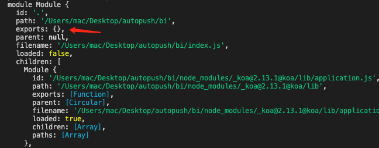

## CommandJS和ES6模块的区别

- [CommandJS和ES6模块的区别](#commandjs和es6模块的区别)
  - [CommonJS规范](#commonjs规范)
    - [module对象](#module对象)
    - [require](#require)
  - [ES6 中的模块化](#es6-中的模块化)
    - [export](#export)
    - [export default](#export-default)
    - [import](#import)
    - [ES6 模块化的特点](#es6-模块化的特点)
  - [CommonJS与ES6 Modules规范的区别](#commonjs与es6-modules规范的区别)

### CommonJS规范

NodeJ s应用模块化使用的是 CommonJS，每一个文件就是一个模块，拥有自己的作用域、变量以及方法，对其他的模块不可见。

**CommoJS 规范加载模块是同步的**，也就是说只有加载完成，才能执行后面的操作。从 Node.js v13.2 版本开始，Node.js 已经默认打开了 ES6 模块支持。但是要求ES6模块采用.mjs后缀名。

#### module对象


NodeJs 在运行某些模块的时会自动创建一个 module 对象，同时会给 module 对象添加一个exports 对象，初始化的值为{}

```js
module.exports = {}
```

  

NodeJs 在模块里可以直接调用 exports 和 module.exports 两个全局变量，但是 exports 只是 module.exports 的一个引用。

**exports的使用**

```js
// add.js
function add(a, b){
    return a + b;
}
exports.plus = plus;

// 其实等价于
module.exports = {
    plus: plus
}
```

**module.exports的使用**

```js
// add.js
function add(a, b){
    return a + b;
}
module.exports = add;
```

#### require

NodeJs 中第一次加载某个模块时，NodeJs 会缓存该模块。以后再加载该模块，就直接从缓存取出该模块的 module.exports 属性，不存在动态更新。**require 返回的值是被输出的值的拷贝，模块内部的变化也不会影响**


require 的参数可以是一个表达式。但是需要注意咯，这个传参可以为表达式并不是 require 特有的。因为JS语言是传值调用，函数或者方法在调用的时候参数会被先计算出来，因此在我们使用 require 方法并传入表达式的时候，会先计算出表达式的值再传递给require。


这里有几个需要注意的点：

- exports 只是 module 对象中 exports 方法的引用
- require 引用模块后，返回的是 module.exports 而不是 exports
- CommandJS 是在运行时加载的


### ES6 中的模块化

在一个文件中，export、import 可以有多个，但是 export default 只能有一个

#### export

export 命令规定的是对外的接口，必须于模块内部的变量建立一一对应关系。export 语句输出的接口，与其对应的值是动态绑定关系，即通过该接口，可以取得模块内部的实时的值，也就是说，当导入对象在模块内值发生变化后，import 导入的对象也会相应的同步变化。

```js
// add.js导出
export var 变量 = 值

export { 变量 }

export { 变量 as 输出的变量 }

// 引用
import { 变量 } from 'add.js' 
```

#### export default

上面的 export 是动态绑定关系。import default 却不是动态的。默认导出的导出结果是值的拷贝而不是引用。**原因是默认导出可以看作一种对“default赋值”的特例，本质上是一种赋值，所以拿到是值而不是引用**。


```js
// add.js导出
export default {
    add(){ }
}

// 引用
import add from 'add.js'
```

**只要是使用`export default`导出的都是值而不是引用**！除了以下的特例：

```js
export default function load() {
    console.log('doing something')
}
```

#### import

import 模块导入与 export 模块导出功能相对应，也存在两种模块导入方式：命名式导入（名称导入）和默认导入（定义式导入）。

#### ES6 模块化的特点

- export 命令和 import 命令可以出现在模块的任何位置，只要处于模块顶层就可以。 如果处于块级作用域内，就会报错，这是因为处于条件代码块之中，就没法做静态优化了（tree shaking），违背了ES6模块的设计初衷


### CommonJS与ES6 Modules规范的区别

- CommonJS 模块是运行时加载，ES6 Modules 是编译时输出接口
- CommonJS 输出是值的拷贝；ES6 Modules 输出的是值的引用，被输出模块的内部的改变会影响引用的改变
- CommonJs导入的模块路径可以是一个表达式，因为它使用的是require()方法；而ES6 Modules只能是字符串
- CommonJS this指向当前模块，ES6 Modules this指向undefined
- 且ES6 Modules中没有这些顶层变量：arguments、require、module、exports、__filename、__dirname
