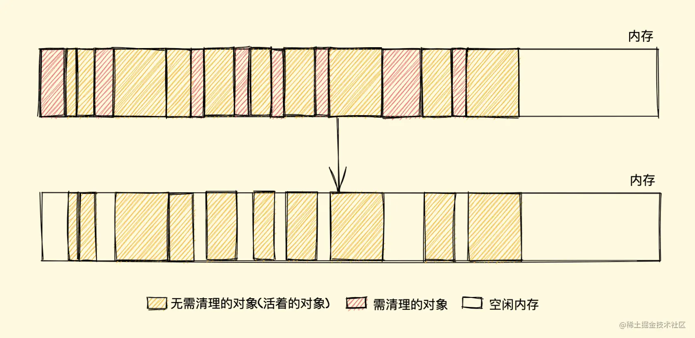
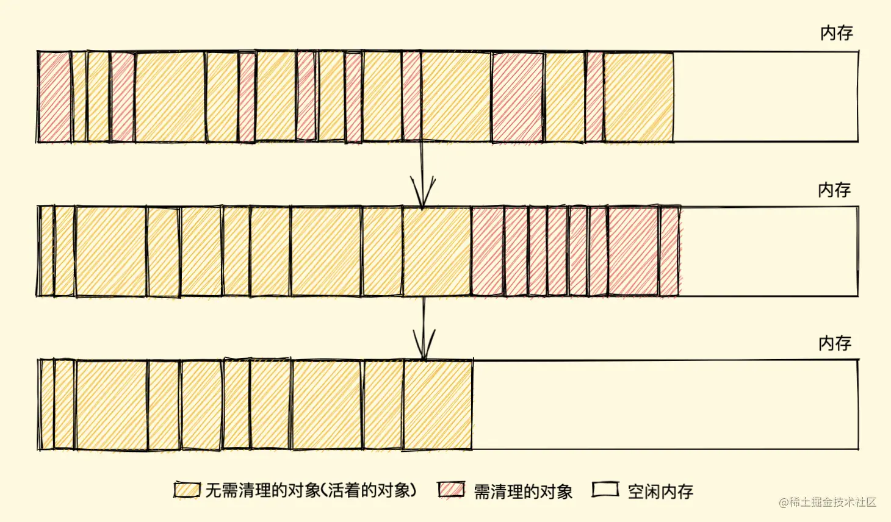

## JS中的垃圾回收机制

### 什么是垃圾回收机制

垃圾回收机制（GC），程序工作过程中会产生很多 垃圾，这些垃圾是程序不用的内存或者是之前用过了，以后不会再用的内存空间，而 GC 就是负责回收垃圾的，因为他工作在引擎内部，所以对于我们前端来说，GC 过程是相对比较无感的，这一套引擎执行而对我们又相对无感的操作也就是常说的 垃圾回收机制 了

当然也不是所有语言都有 GC，一般的高级语言里面会自带 GC，比如 Java、Python、JavaScript 等，也有无 GC 的语言，比如 C、C++ 等，那这种就需要我们程序员手动管理内存了，相对比较麻烦

### 垃圾回收策略

在 JavaScript 内存管理中有一个概念叫做 可达性，就是那些以某种方式可访问或者说可用的值，它们被保证存储在内存中，反之不可访问则需回收
至于如何回收，其实就是怎样发现这些不可达的对象（垃圾）它并给予清理的问题， JavaScript 垃圾回收机制的原理说白了也就是定期找出那些不再用到的内存（变量），然后释放其内存

你可能还会好奇为什么不是实时的找出无用内存并释放呢？其实很简单，实时开销太大了

我们都可以 Get 到这之中的重点，那就是怎样找出所谓的垃圾？
这个流程就涉及到了一些算法策略，有很多种方式，我们简单介绍两个最常见的

- 标记清除算法
- 引用计数算法


### 标记清除算法

标记清除（Mark-Sweep），目前在 JavaScript引擎 里这种算法是最常用的，到目前为止的大多数浏览器的 JavaScript引擎 都在采用标记清除算法，只是各大浏览器厂商还对此算法进行了优化加工，且不同浏览器的 JavaScript引擎 在运行垃圾回收的频率上有所差异

就像它的名字一样，**此算法分为 标记 和 清除 两个阶段**，标记阶段即为所有活动对象做上标记，清除阶段则把没有标记（也就是非活动对象）销毁

你可能会疑惑怎么给变量加标记？其实有很多种办法，比如当变量进入执行环境时，反转某一位（通过一个二进制字符来表示标记），又或者可以维护进入环境变量和离开环境变量这样两个列表，可以自由的把变量从一个列表转移到另一个列表，当前还有很多其他办法。其实，怎样标记对我们来说并不重要，重要的是其策略

引擎在执行 GC（使用标记清除算法）时，需要从出发点去遍历内存中所有的对象去打标记，而这个出发点有很多，我们称之为一组 根 对象，而所谓的根对象，其实在浏览器环境中包括又不止于 全局Window对象、文档DOM树 等

整个标记清除算法大致过程就像下面这样

- 垃圾收集器在运行时会给内存中的所有变量都加上一个标记，假设内存中所有对象都是垃圾，全标记为0
- 然后从各个根对象开始遍历，把不是垃圾的节点改成1
- 清理所有标记为0的垃圾，销毁并回收它们所占用的内存空间
- 最后，把所有内存中对象标记修改为0，等待下一轮垃圾回收


#### 优点

标记清除算法的优点只有一个，那就是实现比较简单，打标记也无非打与不打两种情况，这使得一位二进制位（0和1）就可以为其标记，非常简单

#### 缺点

标记清除算法有一个很大的缺点，就是在清除之后，剩余的对象内存位置是不变的，也会导致空闲内存空间是不连续的，出现了 内存碎片（如下图），并且由于剩余空闲内存不是一整块，它是由不同大小内存组成的内存列表，这就牵扯出了内存分配的问题


  

#### 解决（标记整理（Mark-Compact）算法）

归根结底，标记清除算法的缺点在于清除之后剩余的对象位置不变而导致的空闲内存不连续，所以只要解决这一点，两个缺点都可以完美解决了

而 标记整理（Mark-Compact）算法 就可以有效地解决，它的标记阶段和标记清除算法没有什么不同，只是标记结束后，标记整理算法会将活着的对象（即不需要清理的对象）向内存的一端移动，最后清理掉边界的内存（如下图）

  


### 引用计数算法

引用计数（Reference Counting），这其实是早先的一种垃圾回收算法，它把 对象是否不再需要 简化定义为 对象有没有其他对象引用到它，如果没有引用指向该对象（零引用），对象将被垃圾回收机制回收，目前很少使用这种算法了，因为它的问题很多，不过我们还是需要了解一下


这不过在引用计数这种算法出现没多久，就遇到了一个很严重的问题——循环引用，即对象 A 有一个指针指向对象 B，而对象 B 也引用了对象 A ，如下面这个例子

```js
function test(){
  let A = new Object()
  let B = new Object()
  
  A.b = B
  B.a = A
}
```

如上所示，对象 A 和 B 通过各自的属性相互引用着，按照上文的引用计数策略，它们的引用数量都是 2，但是，在函数 test 执行完成之后，对象 A 和 B 是要被清理的，但使用引用计数则不会被清理，因为它们的引用数量不会变成 0，假如此函数在程序中被多次调用，那么就会造成大量的内存不会被释放


### V8 引擎对 GC 的优化