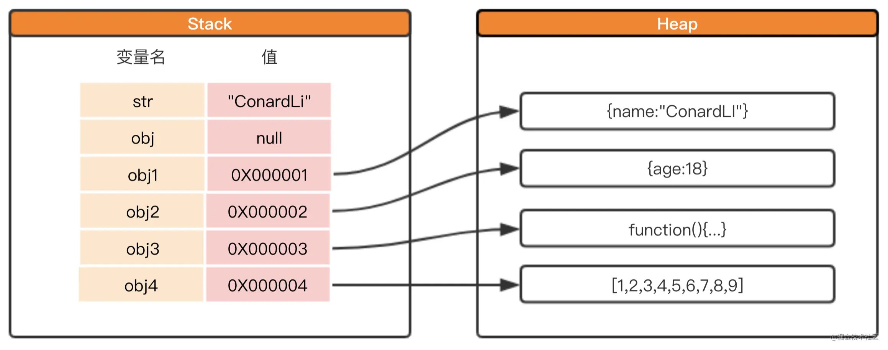

## JS中的堆和栈

### 栈和堆的数据结构

栈一种特殊的列表，栈内的元素只能通过列表的一端访问，这一端称为栈顶。栈被称为是一种先入后出的数据结构。由于栈具有后入先出的特点，所以任何不在栈顶的元素都无法访问。为了得到栈顶的元素，必须先拿掉上面的元素。

堆是一种经过排序的树形数据结构，每个节点都有一个值。通常我们所说的堆的数据结构，是指二叉堆。堆的特点是根节点的值最小（最大），，且根结点的两个子树也是一个堆。 由于堆的这个特性，常用来实现优先队列，堆的存取是随意，这就如同我们在图书馆的书架上取书， 虽然书的摆放是有顺序的，但是我们想取任意一本时不必像栈一样，先取出前面所有的书， 我们只需要关心书的名字

#### 栈内存和堆内存的区别

栈内存：

- 存储的值大小固定
- 空间较小
- 可以直接操作其保存的变量，运行效率高
- 由系统自动分配存储空间

堆内存：

- 存储的值大小不定，可动态调整
- 空间较大，运行效率低
- 无法直接操作其内部存储，使用引用地址读取
- 通过代码进行分配空间

### 基本数据类型

- Number
- String
- Boolean
- Null
- Undefined
- Symbol

**基本数据类型是保存在栈内存中**，因为基本数据类型占用空间小，大小固定，通过按值来访问，属于被频繁使用的数据。

### 引用数据类型

- Object（Array、Map、Set、Function）

**引用数据类型存储在堆内存中**，因为引用类型占用空间大，大小不固定，如果存储在栈中，将会影响程序运行的性能；引用类型在栈中存储了指针，该指针指向堆中该实体的起始地址。当解释器寻找引用值时，会首先检索其在栈中的地址，取得地址后从堆中获得实体。

  
