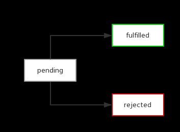

## Promise 的实现原理

- [Promise 的实现原理](#promise-的实现原理)
  - [promise 的产生](#promise-的产生)
  - [Promise 到底是什么](#promise-到底是什么)
  - [Promise/A+ 规范](#promisea-规范)
  - [Promise 实现原理](#promise-实现原理)
  - [简单的 Promise 雏形](#简单的-promise-雏形)
    - [实现链式调用](#实现链式调用)
    - [加入延时机制](#加入延时机制)
    - [加入状态](#加入状态)
    - [链式 Promise](#链式-promise)
    - [最简实现Promise，支持异步链式调用](#最简实现promise支持异步链式调用)
    - [实现链式调用的核心](#实现链式调用的核心)

### promise 的产生

我们可以想象这样一种应用场景，需要连续执行两个或者多个异步操作，每一个后来的操作都在前面的操作执行成功之后，带着上一步操作所返回的结果开始执行

在过去，我们会做多重的异步操作，比如

```js
doFirstThing((firstResult) => {
  doSecondThing(firstResult, (secondResult) => {
    console.log(`The secondResult is:` + secondResult)
  })
})
```

这种多层嵌套来解决一个异步操作依赖前一个异步操作的需求，不仅层次不够清晰，当异步操作过多时，还会出现经典的回调地狱。

那正确的打开方式是怎样的呢？Promise 提供了一个解决上述问题的模式，我们先回到上面那个多层异步嵌套的问题，接下来转变为 Promise 的实现方式：

```js
function doFirstThing() {
  return new Promise((resolve, reject) => {
    setTimeout(() => {
      console.log('获取第一个数据')
      let firstResult = 3 + 4
      resolve(firstResult)
    },400)
  })
}

function doSecondThing(firstResult) {
  console.log('获取第二个数据')
  let secondResult = firstResult * 5
  return secondResult
}

doFirstThing()
  .then(firstResult => doSecondThing(firstResult))
  .then(secondResult => {
    console.log(`The secondResult Result: ${secondResult}`
  )})
  .catch(err => {
    console.log('err',err)
  })
```

### Promise 到底是什么

    promsie 是对异步编程的一种抽象，是一个代理对象，代表一个必须进行异步处理的函数返回的值或抛出的异常

简单来说，Promise 主要就是为了解决异步回调的问题，正如上面的例子所示

可以将异步对象和回调函数脱离开来，通过 then 方法在这个异步操作上绑定回调函数

用 Promise 来处理异步回调函数使得代码更加清晰，便于理解，且更加容易维护，目前其主流规范主要是 Promise/A+ ，下面介绍具体的 API


### Promise/A+ 规范

Promise 规范内容很多，我们挑几个简单的说明下：

1. Promise 本身是一个状态机，每一个 Promise 实例只能有3个状态，pending、fulfilled、rejected，状态之间的转化只能是 `pending -> fulfilled`、`pending -> rejected`
2. Promise 有一个 then 方法，该方法可以被调用多次，并且返回一个 Promise 对象
3. 支持链式调用
4. 内存保存有一个 value 值，用来保存上次执行的结果值，如果报错，则保存的是异常信息

### Promise 实现原理

说到底，Promise 也还是**使用回调函数**，只不过把回调函数封装在了内部，使用上一直通过 then 方法的**链式调用**，使得多层的回调嵌套看起来变成了同一层，书写以及理解上会更直观和简洁一些


### 简单的 Promise 雏形

```js
function getUserId() {
  return new Promise(function(resolve) {
    http.get(url, function(results) {
      resolve(results.id)
    })
  })
}

getUserId().then(function(id) {
  // 一些处理
})
```

我们可以看到 getUserId 方法返回一个 Promise，可以通过它的 `then` 方法注册在 Promise 异步操作成功时执行的回调。

```js
function Promise(fn) {
  var value = null, 
  callbacks = []; // callbacks 为数组，因为可能同时有很多回调

  this.then = function (onFulfilled) {
    callbacks.push(onFulfilled)
  }

  function resolve(value) {
    callbacks.forEach(function (callback) {
      callback(value)
    })
  }

  fn(resolve)
}
```

上面的代码很简单，大致的逻辑是这样的：

1. 调用 `then` 方法，将想要在 Promise 异步操作成功时执行的回调函数放入到 callbacks 队列中，其实也就是**注册回调函数**
2. 创建 promise 实例时传入的函数会被**赋予一个函数类型的参数**，即 resolve，它接收一个参数 value ，代表异步操作返回的结果，当异步操作成功执行后，用户会调用 resolve 方法，这时候其实真正执行的操作是将 callbacks 队列中的回调一一执行


可以结合前面的代码来看，首先 `new Promise` 时，传给 promise 的函数发送异步请求，接着调用 promise 对象的 then 属性，注册请求成功的回调函数，然后当异步请求发送成功时，调用 `resolve(results.id)` 方法, 该方法执行 then 方法注册的回调数组。


#### 实现链式调用

上面实现 Promise 的代码是无法支持链式调用的。想让 then 方法支持链式调用，其实也很简单

```js
this.then = function(onFulfilled) {
  callbacks.push(onFulfilled)
  return this
}
```

#### 加入延时机制

上述的代码还存在一个问题，如果在 then 方法注册回调之前，resolve 函数就执行了怎么办？比如 promise 内部的函数是同步函数：

```js
// 例子
function getUserId() {
  return new Promise(function (resolve) {
    resolve(100)
  })
}

getUserId().then(function(id) {
  // 一些处理
})
```

显然这样是不允许的，Promise/A+ 规范明确要求回调需要通过异步方法执行，用以保证一致可靠的执行顺序。因此我们要加入一些处理，保证在 resolve 执行之前，then 方法已经注册完所有的回调，我们可以这样改造下 resolve 函数：

```js
function resolve(value) {
  setTimeout(function() {
    callbacks.forEach(function(callback) {
      callback(value)
    })
  }, 0)
}
```

上述代码的思路也很简单，就是通过 `setTimeout` 机制，将 `resolve` 中执行回调的逻辑放置到 JS 任务队列末尾，以保证在 `resolve` 执行时，`then` 方法的回调函数已经注册完成.

但是，这样好像还存在一个问题，可以细想一下：如果 Promise 异步操作已经成功，这时，在异步操作成功之前注册的回调都会执行，但是在 Promise 异步操作成功这之后调用的 then 注册的回调就再也不会执行了，这显然不是我们想要的。


#### 加入状态

为了解决上面的问题，我们必须加入状态机制，也就是大家熟知的 pending、fulfilled、rejected


Promise/A+ 规范中的2.1 Promise States 中明确规定了，pending 可以转为 fulfilled 或 rejected 并且只能转化一次，也就是说如果 pending 转化到了 fulfilled 状态，那么就不能再转化到 rejected。并且 fulfilled 和 rejected 状态只能由 pending 状态转化而来，两者之间不能互相转换。

  

改进后的代码是这样的：

```js
function Promise(fn) {
  var state = 'pending'
    value = null,
    callbacks = [];
  
  this.then = function(onFulfilled) {
    if(state == 'pending') {
      callbacks.push(onFulfilled)
      return this
    }
    onFulfilled(value)
    return this
  }

  function resolve(newValue) {
    value = newValue
    state = 'fulfilled'
    setTimeout(function() {
      callbacks.forEach(function(callback) {
        callback(value)
      })
    }, 0)
  }

  fn(resolve)
} 
```

上面的思路是： resolve 执行时，会将状态设置为 fulfilled，在此之后调用 then 添加的新回调，都会立即执行。

这里没有任何地方将 state 设为 rejected，是为了大家聚焦在核心代码上

#### 链式 Promise 

那么问题来了，如果用户在 then 方法里面注册的仍然是一个 Promise ，该怎么解决？比如以下例子：

```js
getUserId()
  .then(getUserJobById)
  .then(function(job) {
    // 对 job 处理
  })

function getUserJobById(id) {
  return new Promise(function (resolve) {
    http.get(baseUrl + id, function(job) {
      resolve(job)
    })
  })
}
```

链式 Promise 是指在当前 Promise 达到 fulfilled 状态后，即开始进行下一个 Promise（后邻 Promise）。那么我们如何衔接当前 Promise 和 后邻 Promise 呢？

只要在 then 方法里面 return 一个 Promise 就好了？？？（不是很理解）

以上内容源自：

[30分钟，让你彻底明白Promise原理](https://mengera88.github.io/2017/05/18/Promise%E5%8E%9F%E7%90%86%E8%A7%A3%E6%9E%90/)

#### 最简实现Promise，支持异步链式调用


```js
function Promise(fn) {
  // 用来保存通过 then 方法注册的回调
  this.cbs = [];

  /* 
    在 Promise/A+ 规范中肯定不是通过 setTimeout 来实现的，
    setTimeout 是属于宏任务，可以通过 queueMicrotask 方法来实现
  */
  const resolve = (value) => {
    setTimeout(() => {
      this.data = value;
      this.cbs.forEach((cb) => cb(value));
    });
  }

  fn(resolve);
}

// 也就是上文说到的通过 return Promise 来实现异步链式调用 
Promise.prototype.then = function (onResolved) {
  return new Promise((resolve) => {
    this.cbs.push(() => {
      const res = onResolved(this.data);
      if (res instanceof Promise) {
        res.then(resolve);
      } else {
        resolve(res);
      }
    });
  });
};

```

#### 实现链式调用的核心

- 当前一个 Promise 完成后，调用其 resolve 变更状态，在这个 resolve 里依次调用 callbacks 里面的回调，这样就执行 then 方法了
- 上一步中，当 then 方法执行完毕后，返回一个结果。如果这个结果是个简单的值，就直接调用 新 Promise 的 resolve ，让其状态变更，这又会依次调用新 Promise 的 callbacks 数组里的方法，循环往复...如果返回的结果是个 Promise，则需要等它完成之后再触发新 Promise 的 resolve，所以可以在其结果的 then 里面调用新 Promise 的 resolve


可以看这个例子：
```js
new Promise((resolve) => {
  setTimeout(() => {
    // resolve1
    resolve(1);
  }, 500);
})
  // then1
  .then((res) => {
    console.log(res);
    // user promise
    return new Promise((resolve) => {
      setTimeout(() => {
        // resolve2
        resolve(2);
      }, 500);
    });
  })
  // then2
  .then(console.log);

```
then1这一整块其实返回的是 promise2，那么 then2 其实本质上是 promise2.then(console.log)，
也就是说 then2注册的回调函数，其实进入了promise2的 cbs 回调数组里，又因为我们刚刚知道，resolve2 调用了之后，user promise 会被 resolve，进而触发 promise2 被 resolve，进而 promise2 里的 cbs 数组被依次触发。
这样就实现了用户自己写的 resolve2 执行完毕后，then2 里的逻辑才会继续执行，也就是异步链式调用。

参考文章：

[最简实现Promise，支持异步链式调用（20行）](https://juejin.cn/post/6844904094079926286)


