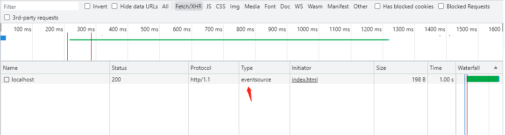

## EventSource

`EventSource` 接口是 web 内容与服务器发送事件通信的接口。

一个 `EventSource` 实例会对 HTTP 服务器开启一个持久化的连接，以 `text/event-stream` 格式发送事件，此连接会一直保持开启直到通过调用 `EventSource.close()` 关闭。



（被持久化的 HTTP 请求的 type 为 eventsource）

一旦连接开启，来自服务端传入的消息会以事件的形式分发至你代码中。如果接收消息中有一个 event 字段，触发的事件与 event 字段的值相同。如果不存在 event 字段，则将触发通用的 message 事件。

与 WebSocket 不同的是，**服务器发送事件是单向的**。数据信息只能从服务端到发送到客户端（如用户的浏览器）。

当不需要以消息形式将数据从客户端发送到服务器时，这使它们成为绝佳的选择。例如，对于处理社交媒体状态更新，新闻提要或将数据传递到客户端存储机制（如 IndexedDB 或 web 存储）之类的，`EventSource` 无疑是一个有效方案。

### 使用案例

我们使用 nodejs 作为服务端，一探 EventSource 的使用方法

#### 服务端

```js
const http = require('http')

// 创建服务器
const server = http.createServer((req, res) => {
  // 设置响应头，指定为事件流格式
  res.writeHead(200, {
    'Content-Type': 'text/event-stream',
    'Cache-Control': 'no-cache',
    Connection: 'keep-alive',
    'Access-Control-Allow-Origin': '*',
  })

  // 定期向客户端发送事件数据
  setInterval(() => {
    const currentTime = new Date().toISOString()
    const eventData = `data: ${currentTime}\n\n`

    // 发送事件数据
    res.write(eventData)
  }, 1000)
})

// 监听端口
server.listen(3000, () => {
  console.log('Server is running on http://localhost:3000')
})
```

需要注意一点的是，向 `EventSource` 传入数据的格式为 `data: 需要传入的数据 \n\n`

#### 客户端

```html
<!DOCTYPE html>
<html>
  <head>
    <title>EventSource Example</title>
  </head>
  <body>
    <h1>Real-Time Server Time:</h1>
    <div id="output"></div>

    <script>
      // 创建 EventSource 对象，指定服务器端的 URL
      const eventSource = new EventSource('http://localhost:3000')

      // 监听 message 事件，在接收到服务器发送的事件时进行处理
      eventSource.addEventListener('message', (event) => {
        console.log('event', event)
        // 获取事件的数据并更新页面上的内容
        const currentTime = event.data
        document.getElementById('output').innerText = currentTime
      })
    </script>
  </body>
</html>
```
