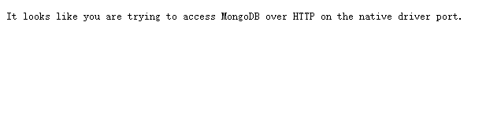

### CentOs环境下安装MongoDB

- [CentOs环境下安装MongoDB](#centos环境下安装mongodb)
  - [下载并解压](#下载并解压)
  - [配置相关内容](#配置相关内容)
  - [关闭防火墙](#关闭防火墙)
  - [创建和删除用户](#创建和删除用户)

#### 下载并解压

centos 下直接使用 wget 下载

```
wget https://fastdl.mongodb.org/linux/mongodb-linux-x86_64-3.6.13.tgz
```

创建目录 /usr/local/mongoDB ，并解压之后把文件放入该文件夹

```
tar -zxvf mongodb-linux-x86_64-3.6.13.tgz #解压

mv  mongodb-linux-x86_64-3.6.13/ /usr/local/mongodb
```

#### 配置相关内容

**配置环境变量**

```
// 修改etc下的profile文件
vim /etc/profile
在 export PATH USER LOGNAME MAIL HOSTNAME HISTSIZE HISTCONTROL 一行的上面添加如下内容：

#加入环境变量
MONGODB_HOME=/usr/local/mongodb
PATH=$PATH:$MONGODB_HOME/bin
```

**创建数据库目录以及日志目录**

```
mkdir -p /usr/local/mongodb/data
mkdir -p /usr/local/mongodb/logs
```

**创建配置文件**

```
vim /usr/local/mongodb/mongo.conf

#加入以下内容
dbpath=/usr/local/mongodb/data
logpath=/usr/local/mongodb/logs/mongo.log #事先创建该文件
logappend=true
journal=true
quiet=true
port=27017 #端口号
fork=true #后台运行
bind_ip=0.0.0.0 #允许任何IP进行连接
```

**启动服务**

```
cd /usr/local/mongodb
bin/mongod -f /usr/local/mongodb/mongo.conf
```

启动成功后，在浏览器中输入服务器的 IP + 端口，如果出现以下截图的内容，就证明运行成功了。

  

**进入mongoDB命令界面**

```
bin/mongo
```

#### 关闭防火墙

```
// 永久开放27017端口
firewall-cmd --zone=public --permanent --add-port=27017/tcp; firewall-cmd --reload

// 如果报错 FirewallD is not running, 就执行
systemctl restart firewalld
```


#### 创建和删除用户

**！！！【在没有设置开启权限设置之前才可以创建用户，否则会报错没有权限】**

**创建用户**

```
// 进入用户所在的数据库
bin/mongo 
use admin

db.createUser(
  {
    user: "root",
    pwd: "admin123456789",  
    roles: [
       { role: "root", db: "admin" }
    ]
  }
)

```

**删除用户**

```
// 进入用户所在的数据库
bin/mongo 
use admin

db.removeUser('zcd')
```

| roles | 属性  |
|--|--|
| read | 让用户能够读取当前数据库中的任何集合的数据 |
| readWrite | 用户可以读写当前数据库中的任何集合，读写包括插入、删除、更新文档以及创建、重命名、删除集合 |
| readAnyDatebase | 任何数据库的只读权限 |
| userAdminAnyDatabase | 任何数据库的读写权限 |
| userAdminAnyDatabase | 任何数据库用户的管理权限 |
| dbAdminAnyDatabase | 任何数据库的管理权限 |
| root | 提供对所有资源的访问权限。集合了readWriteAnyDatabase、dbAdminAnyDatabase、userAdminAnyDatabase、clusterAdmin、backup这些角色的所有权限。 |


**创建用户成功后，可以修改 mongo.conf 文件，重新运行 MongoDB**

```
vim /usr/local/mongodb/mongo.conf
添加一句
auth=true #开启验证
```