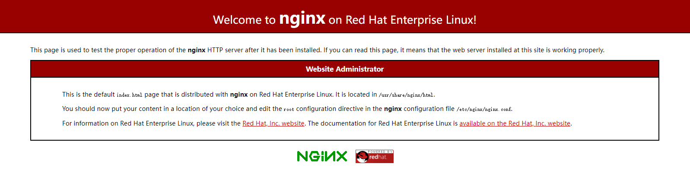

### 安装Nginx服务和Nginx的相关配置


#### centos中使用yum安装Nginx

**添加源**

默认情况Centos7中无 Nginx 的源，最近发现 Nginx 官网提供了 Centos 的源地址。因此可以如下执行命令添加源：

```
sudo rpm -Uvh http://nginx.org/packages/centos/7/noarch/RPMS/nginx-release-centos-7-0.el7.ngx.noarch.rpm
```

**安装Nginx**

通过yum search nginx看看是否已经添加源成功。如果成功则执行下列命令安装Nginx。

```
sudo yum install -y nginx
```

**启动Nginx并设置开机自动运行**

```
sudo systemctl start nginx.service
sudo systemctl enable nginx.service
```

**校验是否安装成功**

打开服务器的公网 IP ，是否有 Nginx 的默认界面。

Nginx 的默认位置在 `/etc/nginx/nginx.conf`

  


**Nginx的相关命令**

查看 nginx 当前版本的信息

```
nginx -v
```

测试 nginx 是否配置正确

```
nginx -t
```

重启 nginx 服务

```
nginx -s reload
```


#### Nginx配置 SSL 证书和开启 HTTP2

拿到指定域名的 SSL 证书后


```
server {
    listen       443 ssl http2 default_server; #开启 ssl 和 http2
    listen       [::]:443 ssl http2 default_server;
    server_name  huaruan.tk;  # 为指定的域名
    root         /usr/share/nginx/html;

    ssl_certificate "/etc/nginx/cert/huaruan.tk_bundle.pem";
    ssl_certificate_key "/etc/nginx/cert/huaruan.tk.key";
    ssl_session_cache shared:SSL:1m;
    ssl_session_timeout  10m;
    ssl_ciphers PROFILE=SYSTEM;
    ssl_prefer_server_ciphers on;

    # Load configuration files for the default server block.
    include /etc/nginx/default.d/*.conf;

    location / {
    }

    error_page 404 /404.html;
        location = /40x.html {
    }

    error_page 500 502 503 504 /50x.html;
        location = /50x.html {
    }
}

```