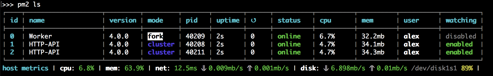
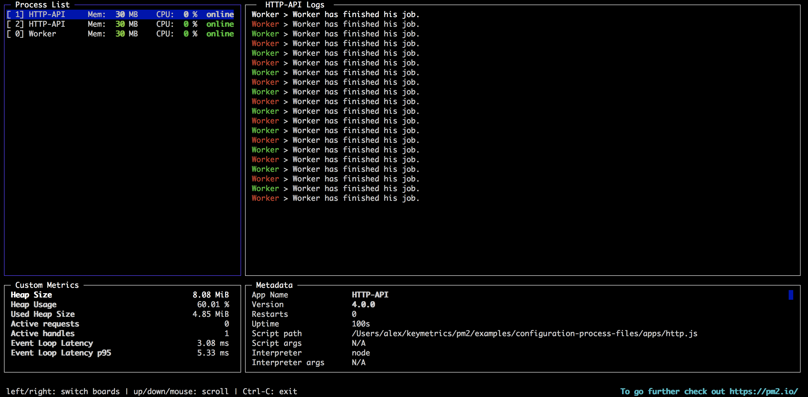

## PM2

- [PM2](#pm2)
  - [介绍](#介绍)
  - [安装](#安装)
  - [启动](#启动)
  - [管理流程](#管理流程)
  - [监控面板](#监控面板)
  - [集群模式](#集群模式)
  - [生态系统文件](#生态系统文件)
  - [PM2 中 fork 模式和 cluster 模式](#pm2-中-fork-模式和-cluster-模式)
  - [restart 和 reload 的区别](#restart-和-reload-的区别)

 
### 介绍

`PM2` 是一个带有负载均衡的守护进程管理器。`PM2` 入门非常简单，它以简单直观的 `CLI` 形式提供，可通过 `NPM` 安装。

### 安装

```
npm install pm2@latest -g
```

### 启动

```shell
pm2 start app.js

# pm2运行npm脚本
pm2 start npm --name <app name> -- run <scriptName>
```

可以传递给 CLI 一些选项：

```shell
--name <app_name> # 指定应用程序名称

--watch # 当文件更改时监视并重新启动应用程序

--restart-delay <delay in ms> # 自动重启之间的延迟

--time # 为日志添加时间前缀

--no-autorestart # 不自动重启程序

--no-daemon # 非守护进程模式
```

### 管理流程

```shell
pm2 restart app_name # 重新启动应用程序（进程先停止再启动）

pm2 reload app_name # 重载（保持进程在运行状态刷新）

pm2 stop app_name # 停止指定应用程序

pm2 delete app_name # 删除指定应用程序

pm2 [list | ls | l | status] # 查看进程

pm2 logs # 实时显示日志
```

  


### 监控面板

`PM2` 提供了一种监控应用程序资源使用情况的简单办法。

```shell
pm2 monit
```

  


### 集群模式

对于 `Node.js` 应用程序，`PM2` 包括一个自动负载均衡器，它将在每个衍生进程之间共享所有 `HTTP/Websocket/TCP/UDP` 连接。底层实现是通过 `Node.js` 的 `cluster` 模块。

在集群模式下，我们要确保应用进程没有内部状态。

内部状态通常是存储在进程中的一些本地数据。例如，它可以是一组 `websocket` 的连接或本地 `session`。我们可以使用 Redis 或其他数据库来共享进程间的状态。

我们知道使用 restart 命令时，pm2 先杀掉进程然后重启进程，所以重启的这段时间是无法使用服务的。但是使用 reload 命令，pm2 滚动重启所有进程，并会保持至少有一个进程正在运行。

**如果 reload 应用程序超时，将会退回使用 restart 。**

```shell
# max 意味着 PM2 将自动检测可用 CPU 的数量并运行尽可能多的进程
pm2 start start app.js -i max 

# pm2 可以通过 scale 命令即时调整集群数，如果线上运行时发现worker数不足以支撑请求
pm2 scale <appName> +3
```

### 生态系统文件

我们还可以创建一个称为生态系统文件的配置文件来管理多个应用程序

```shell
# 生成生态系统文件

pm2 ecosystem
```

这将生成一个 `ecosystem.config.js` 文件：

```js
module.exports = {
  apps : [{
    name: "app",
    script: "./app.js",
    env: {
      NODE_ENV: "development",
    },
    env_production: {
      NODE_ENV: "production",
    }
  }, {
     name: 'worker',
     script: 'worker.js'
  }]
}
```

### PM2 中 fork 模式和 cluster 模式

`fork` 模式是最基本的进程运行方式，只是**单实例**运行 server，无法实现 TCP 连接共享。常用于多语言混编如 PHP、Python 等，不支持端口复用，需要自己做应用的端口分配和负载均衡的子进程业务代码。

缺点就是**单服务实例容易由于异常导致服务器实例崩溃**。

`cluster` 模式，多实例多进程，但是只支持 `Node`，端口可以复用，不需要额外的端口配置，0 代码实现负载均衡。

优点：由于是多实例机制，可以保证服务器的容错性，就算出现异常也不会使多个服务器实例同时崩溃。


### restart 和 reload 的区别

restart 是杀死并重新启动进程

reload 可以实现 0 秒的停机重新加载。`pm2 reload <appName>` 可以重启 app 对应的所有 `worker`，重启对于每一个 `worker`，会在一个新的 `worker` 生成之后再 `kill` 掉之前的 `worker`，这样即使是在对服务器进行更新时，也可以正常处理用户的请求，做到无缝升级重启。

