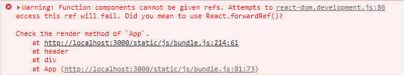

## react 中的 forwardRef 和 useImperativeHandle

### forwardRef 官方方法定义

```ts
interface ForwardRefRenderFunction<T, P = {}> {
  (props: PropsWithChildren<P>, ref: ForwardedRef<T>): ReactElement | null
  displayName?: string | undefined
  // explicit rejected with `never` required due to
  // https://github.com/microsoft/TypeScript/issues/36826
  /**
   * defaultProps are not supported on render functions
   */
  defaultProps?: never | undefined
  /**
   * propTypes are not supported on render functions
   */
  propTypes?: never | undefined
}

function forwardRef<T, P = {}>(
  render: ForwardRefRenderFunction<T, P>
): ForwardRefExoticComponent<PropsWithoutRef<P> & RefAttributes<T>>
```

`React.forwardRef` 接受渲染函数作为参数。React 将使用 props 和 ref 作为参数来调用此函数。此函数应返回 React 节点。

### 使用场景和目的

ref 的作用是获取实例，可能是 DOM 实例，也可能是 ClassComponent 实例，如果目标组件时一个 FunctionComponent 的话，是没有实例的，此时使用 ref 去传递就会报错：

  


`React.forwardRef` 会创建一个 `React` 组件，这个组件能够将其接受的 `ref` 属性转发到其组件树下的另一个组件中。在以下两种场景中特别有用：

- 转发 refs 到 DOM 组件中
- 在高阶组件中转发 refs

```jsx
const FancyButton = React.forwardRef((props, ref) => (
  <button ref={ref} className='FancyButton'>
    {props.children}
  </button>
))

// You can now get a ref directly to the DOM button:
const ref = React.createRef()
;<FancyButton ref={ref}>Click me!</FancyButton>

// 父组件就可以通过 ref.current 拿到 button 实例
```

在上述的示例中，React 会将 `<FancyButton ref={ref}>` 元素的 ref 作为第二个参数传递给 `React.forwardRef` 函数中的渲染函数。该渲染函数会将 ref 传递给 `<button ref={ref}>` 元素。

因此，当 `React` 附加了 `ref` 属性之后，`ref.current` 将直接指向 `<button> DOM 元素` 实例。

---

### useImperativeHandle 方法定义

```ts
type DependencyList = ReadonlyArray<any>

function useImperativeHandle<T, R extends T>(
  ref: Ref<T> | undefined,
  init: () => R,
  deps?: DependencyList
): void
```

### 使用

```jsx
useImperativeHandle(ref, createHandle, [deps])
```

useImperativeHandle 可以让你在使用 ref 时自定义暴露给父组件的实例值。在大多数情况下，应当避免使用 ref 这样的命令式代码。
`useImperativeHandle` 应当与 `forwardRef` 一起使用：

```jsx
function FancyInput(props, ref) {
  const inputRef = useRef()
  useImperativeHandle(ref, () => ({
    focus: () => {
      inputRef.current.focus()
    },
  }))
  return <input ref={inputRef} />
}
FancyInput = forwardRef(FancyInput)
```

这样父组件通过转发 refs 拿到的属性只有 useImperativeHandle 定义过的属性。
