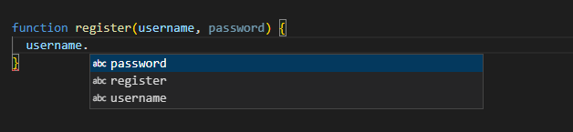
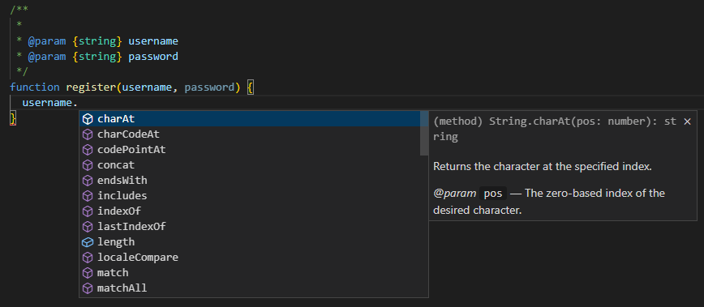

## JavaScript 文件里的类型检查

- [JavaScript 文件里的类型检查](#javascript-文件里的类型检查)
  - [定义对象类型 @type](#定义对象类型-type)
  - [定义函数参数和返回值 @param 和 @returns](#定义函数参数和返回值-param-和-returns)
  - [定义自定义类型和属性 @typedef、@property、@prop](#定义自定义类型和属性-typedefpropertyprop)
  - [定义泛型类型 @template](#定义泛型类型-template)
  - [定义函数类型（回调函数） @callback](#定义函数类型回调函数-callback)
  - [定义构造器 @class 和 @constructor](#定义构造器-class-和-constructor)
  - [定义枚举 @enum](#定义枚举-enum)
  - [定义 this 指向 @this](#定义-this-指向-this)
  - [JSDoc 的用途](#jsdoc-的用途)

TypeScript 2.3 以后的版本支持使用--checkJs 对.js 文件进行类型检查和错误提示。

**用 JSDoc 类型表示类型信息**

`.js` 文件里，类型可以和在 `.ts` 文件里一样被推断出来。 同样地，当类型不能被推断时，它们可以通过 `JSDoc` 来指定，就好比在 `.ts` 文件里那样。 如同 TypeScript，--noImplicitAny 会在编译器无法推断类型的位置报错。 （除了对象字面量的情况；后面会详细介绍）

### 定义对象类型 @type

```ts
/**
 * 定义string类型
 * @type {string}
 */
var name = 'xyz'

/**
 * 定义boolean类型
 * @type {boolean}
 */
var isSelected = false

/**
 * 定义字符串数组类型
 * @type {Array<string>}
 */
var strArr = ['1', '2']

// 也可以使用下面这两种
/**
 * @type {Array.<string>}
 */

/**
 * @type {string[]}
 */

/**
 * 这是 TypeScript 定义的 Navigator 类型
 * @type {Navigator}
 */
var navigator

/**
 * 定义了一个Animal类型，具有名称、年龄两个属性
 * @type {{ name: string, age: number }}
 */
var cat = { name: 'miao', age: 2 }

/**
 * 用来描述一个可能是string或boolean的类型
 * @type {(string | boolean)}
 */
var stringOrBoolean = ''
stringOrBoolean = false
```

### 定义函数参数和返回值 @param 和 @returns

- @param 用来定义函数参数，使用了和 @type 相同的类型语法
- @returns 用来定义函数返回值

```ts
/**
 * @param {string}  p1 - string 类型参数
 * @param {string=} p2 - 可选参数，string 类型
 * @param {string} [p3] - 可选参数，string 类型，另一个可选参数写法
 * @param {string} [p4="test"] - 带默认值的可选参数
 * @returns {string} 返回值为 string 类型
 */
function stringsStringStrings(p1, p2, p3, p4) {
  // TODO
}
```

### 定义自定义类型和属性 @typedef、@property、@prop

- 如果要创建有一些在 JSDoc 中使用的复杂类型，就需要使用 @typedef 去定义这个类型
- 使用 @property 或 @prop 去定义类型的属性
- 定义完成后，使用@type 去使用自定义的类型

**在 JSDoc 中使用 `=` 来表示一个属性是可选的**

```ts
/**
 * @typedef {object} SpecialType  - 这是自定义的 SpecialType 类型
 * @property {string} prop1 - 复杂类型的一个 string 类型属性
 * @property {number} prop2 - 复杂类型的一个 number 类型属性
 * @property {number=} prop3 - 复杂类型的一个 number 类型属性，可选
 * @prop {number} [prop4] - 复杂类型的一个 number 类型属性，可选
 * @prop {number} [prop5=42] - 复杂类型的一个 number 类型属性，有默认值
 */

// 通过 @type 来使用定义的复杂类型

/** @type {SpecialType} */
var specialTypeObject
```

**需要注意的是，在 JSDoc 中使用 `@typedef` 标记创建的类型别名不会自动导入到 TypeScript 中**，如果需要在 TypeScript 中使用这个类型别名，需要使用 JSDoc 的 `@module` 标记改文件导出为一个模块，再通过 import 语句导入这个模块。

```ts
/**
 * @module specialType
 * @typedef {object} SpecialType  - 这是自定义的 SpecialType 类型
 * @property {string} prop1 - 复杂类型的一个 string 类型属性
 * @property {number} prop2 - 复杂类型的一个 number 类型属性
 */

import { SpecialType } from './specialType.jsdoc'

const p: SpecialType = { prop1: 'Alice', prop2: 25 }
```

### 定义泛型类型 @template

泛型类型可以让我们在一个函数或类的定义中指定一些参数类型，这些参数类型可以在函数或类的方法中使用。

```ts
/**
 * @template {string} K - K 必须是一个 string 类型
 * @template {{ serious(): string }} Seriousalizable 必须要有 serious 方法
 * @param {K} key
 * @param {Seriousalizable} object
 */
function seriousalize(key, object) {
  // something
}
```

### 定义函数类型（回调函数） @callback

```ts
/**
 * @callback NameOfCallback
 * @param {string} paramName1
 * @param {string} paramName2
 * @returns {string}
 */
```

上面定义了一个函数类型为 `NameOfCallback`，使用如下：

```ts
/** @type {NameOfCallback} */
function fn(name1, name2) {}
```

### 定义构造器 @class 和 @constructor

`@class`、`@constructor` 可以用来定义构造函数，并且**只允许通过 `new` 关键字来调用构造函数**。

编辑器通过 this 属性的赋值来推断构造函数，为了可以让检查更严格、提示更友好，可以添加一个 @constructor 标记

```ts
/**
 * @constructor
 * @param {number} data
 */
function C(data) {
  // property types can be inferred
  this.name = 'foo'

  // or set explicitly
  /** @type {string | null} */
  this.title = null

  // or simply annotated, if they're set elsewhere
  /** @type {number} */
  this.size

  this.initialize(data) // Argument of type 'number' is not assignable to parameter of type 'string'.
}

/**
 * @param {string} s
 */
C.prototype.initialize = function (s) {
  this.size = s.length
}

var c = new C(0)
c.size

var result = C(1) // Value of type 'typeof C' is not callable. Did you mean to include 'new'?
```

### 定义枚举 @enum

@enum 标记允许创建一个对象字面量，它的成员都有确定的类型。

```ts
/** @enum {number} */
const JSDocState = {
  BeginningOfLine: 0,
  SawAsterisk: 1,
  SavingComments: 2,
}

JSDocState.SawAsterisk
```

### 定义 this 指向 @this

编辑器通常可以通过上下文来推断 this 的类型，我们也可以通过 @this 来明确指定它的类型

```ts
/**
 * @this {HTMLElement}
 * @param {*} e
 */
function callbackForLater(e) {
  this.clientHeight = parseInt(e) // should be fine!
}
```

### JSDoc 的用途

使用 vscode 时，可以给我们的 js 代码提供友好的代码提示，如图





我们使用 vscode 编写函数过程中，函数的形参是一个字符串，我们在写代码的时候 vscode 并不知道形参的类型，导致我们在写代码的时候并不会得到很好的代码提示！

这个时候我们可以使用 JSDoc 来解决这个问题，我们能看到所有的方法就能提示出来了，因为我们 JSDoc 生成的注释里面，执行的 username 参数的类型。
