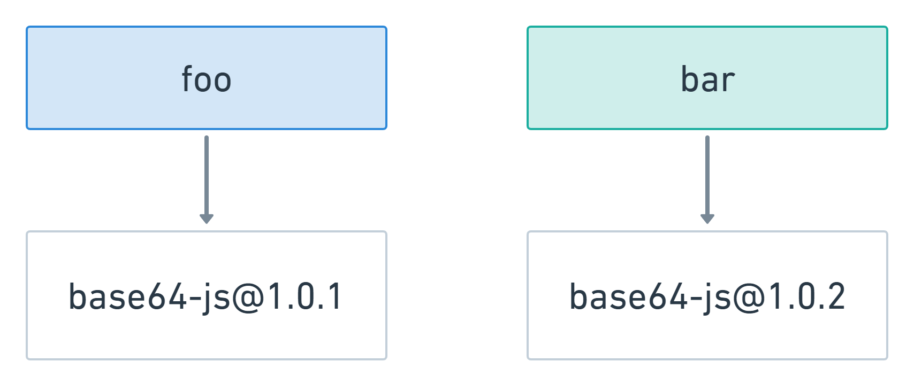
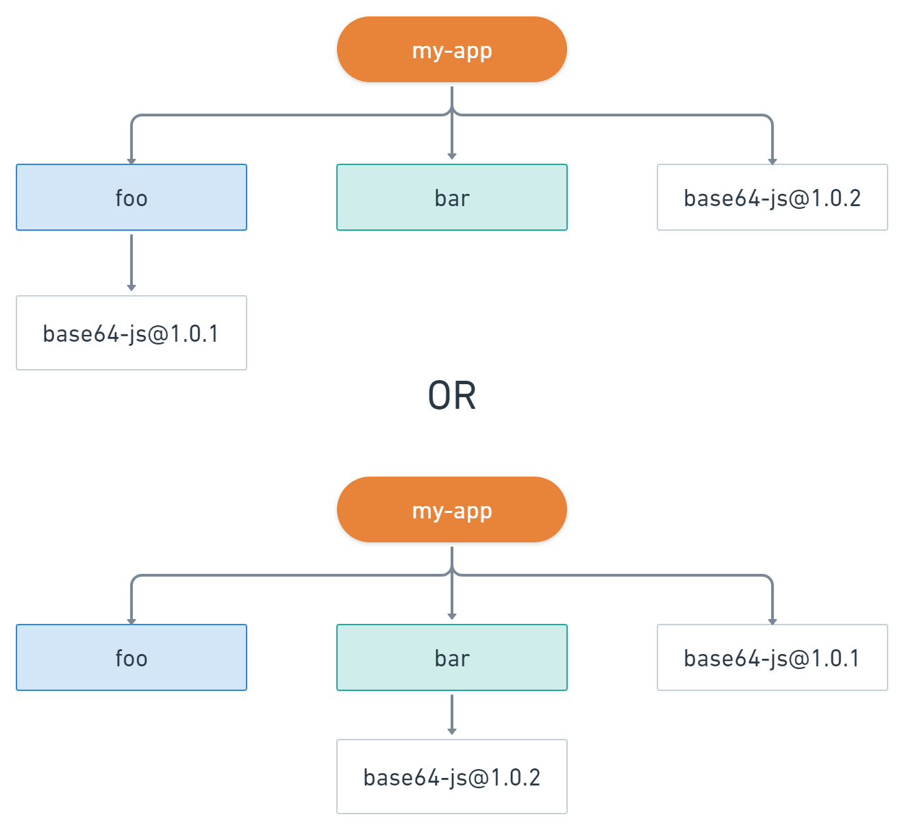

## npm 和 yarn 的区别

- [npm 和 yarn 的区别](#npm-和-yarn-的区别)
  - [语义化版本](#语义化版本)
  - [npm install 原理](#npm-install-原理)
    - [早期的 npm](#早期的-npm)
    - [现在的 npm](#现在的-npm)
  - [lockfile的作用（package-lock.json 和 yarn.lock）](#lockfile的作用package-lockjson-和-yarnlock)
  - [pnpm 依赖管理](#pnpm-依赖管理)

### 语义化版本

**版本格式：主版本号.次版本号.修订号**，版本号递增规则如下：

主版本号：当你做了不兼容的 API 修改
次版本号：当你做了向下兼容的功能性新增
修订号：当你做了向下兼容的问题修正

先行版本号及版本编译信息可以加到“主版本号.次版本号.修订号”的后面，作为延伸。

[语义化版本 2.0.0](https://semver.org/lang/zh-CN/)

npm 中使用语义化版本来控制版本依赖包的版本，比如 ^~>=< 之类的范围符号，不过文中版本号的解析方式不是重点，只需要知道如果使用范围版本号，npm 会安装范围内可用的最新版本。

- ~ 会匹配最近的小版本依赖包，比如 ~1.2.3 会匹配所有 1.2.x 版本，但是不包括 1.3.0
- ^ 会匹配最新的大版本依赖包，比如 ^1.2.3 会匹配所有 1.x.x 的包，包括 1.3.0 但是不包括 2.0.0

[npm 官网中的举例](https://docs.npmjs.com/cli/v8/commands/npm-update)


### npm install 原理

我们执行完 npm install 之后

1. 依赖包是如何到达 node_modules 当中？
2. node_modules 内部如何管理依赖

执行命令后，首先会构建依赖树，然后针对每个节点下的包，会经历下面四个步骤：

1. 将依赖包的版本区间解析为某个具体的版本号
2. 下载对应版本依赖的 tar 包到本地离线镜像
3. 将依赖从离线镜像解压到本地缓存
4. 将依赖从缓存拷贝到当前目录的 node_modules 目录中


然后对应的包就会到达项目的 node_modules 当中。那么，这些依赖在 node_modules 内部是什么样的目录结构？

#### 早期的 npm

其实在最早期的npm版本(npm v2)，npm 的设计可以说是非常的简单,在安装依赖的时候会将依赖放到 node_modules 文件中；
同时，如果某个直接依赖A依赖于其他的依赖包B，那么依赖B会作为间接依赖，安装到依赖A的文件夹 node_modules 中，然后可能多个包之间也会有出现同样的依赖递归的，如果项目一旦过大，那么必然会形成一棵巨大的依赖树，依赖包会出现重复，形成嵌套地狱。

这种嵌套地狱带来的弊端有哪些呢？

- 首先，项目的依赖树的层级过于深，如果有问题不利于排查和调试
- 在依赖的分支中，可能会出现同样版本的相互依赖的问题

带来的后果就是

- 首先，会使得安装的结果占据了大量的空间资源，**造成了资源的浪费**
- 同时，因为安装的依赖重复，会造成在安装依赖时，**安装时间过长**
- 甚至是，因为目录层级过深，导致文件路径过长，会在 windows 系统下删除 node_modules 文件，**出现删除不掉的情况**

文件目录结构为：

```
node_modules
└─ foo
   ├─ index.js
   ├─ package.json
   └─ node_modules
      └─ bar
         ├─ index.js
         └─ package.json
```

#### 现在的 npm

从 npm3 开始，包括 yarn 都着手通过**扁平化依赖**的方式来解决这个问题。相信大家都有这样的体验，我明明就装个 express ，为什么 node_modules 里面多了这么多东西？

这就是扁平化依赖管理的结果。相比之前的嵌套结构，现在的目录结构类似于下面这样：

```
node_modules
├─ foo
|  ├─ index.js
|  └─ package.json
└─ bar
   ├─ index.js
   └─ package.json
```

所有的依赖都被拍平到 node_modules 目录下，不再有深层次的嵌套关系。这样在安装新的包时，根据 node require 机制，会不停往上级的 node_modules 当中去找，如果找到**相同版本的包**就不会重复安装，解决了大量包重复安装的问题，而且依赖层级也不会太深。

之前的问题是解决了，但仔细想想这种扁平化的的处理方式，它真的是无懈可击吗？并不是，它照样存在诸多问题，梳理一下：

1. 依赖结构的不确定性
2. 扁平化算法本身的复杂度很高，耗时较长
3. 项目中仍然可以非法访问没有声明过依赖的包

后面两点都是好理解，那第一点中的不确定性是什么意思？这里来详细解释一下。

假如现在项目依赖两个包 foo 和 bar，这两个包的依赖又是这样的：

  

那么 npm/yarn install 的时候，通过扁平化处理之后，究竟是怎样？

  


答案是：都有可能。取决于 foo 和 bar 在 package.json 中的位置，如果 foo 声明在前面，那么后面的结构，否则就是前面的结构。

npm 会遍历所有的节点，逐个将模块放在 node_modules 的第一层，当发现有重复模块时，则丢弃。如果遇到某些依赖版本不兼容的问题，则会将依赖放在自己的 node_modules 中。

这就是为什么会产生依赖结构的不确定问题，也是 lock 文件诞生的原因，无论是 package-lock.json 还是 yarn.lock，都是为了 npm install 之后产生确定的 node_modules 结构。


### lockfile的作用（package-lock.json 和 yarn.lock）

### pnpm 依赖管理 
