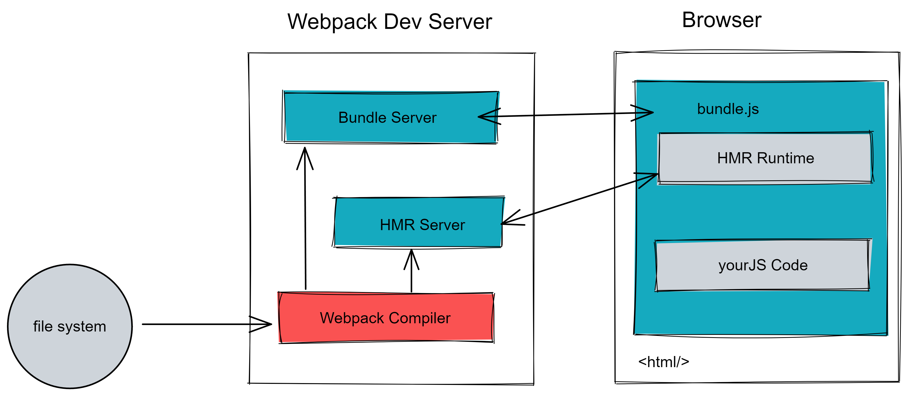

## Webpack-dev-server 原理

- `Webpack Compiler` 将 JS 编译成 Bundle

- `HMR Server` 将热更新的文件输出给 `HMR Runtime`

- `Bundle Server` 提供文件在浏览器的访问

- `HMR Runtime` 会被注入到浏览器（以单独文件的形式？）更新文件的变化（重新拉取文件？）

- `bundle.js` 构建输出的文件

### 启动阶段：

文件系统编译（经过 `Webpack Compiler`）成打包文件，再将打包文件传输给 `Bundle Server`

`Bundle Server` 就是一个服务器，主要实现的功能是给浏览器（客户端）提供以服务形式（而不是文件形式）访问的能力

### 更新阶段：

`webpack` 的监听能力 https://webpack.docschina.org/configuration/watch#root

当文件发生改变，`webpack` 会监听到文件的变化，然后再将变化后的文件发送给 `HMR Server`，`HMR Server`（服务器）会将改变的部分以 JSON 的数据格式通知给 `HMR Runtime`（客户端）

`HMR Server` 与 `HMR Runtime` 之间的传输是通过 websocket 传输的

module、chunck、bundle 的区别

我们直接写出来的是 module，webpack 处理时是 chunk，最后生成浏览器可以直接运行的 bundle。
