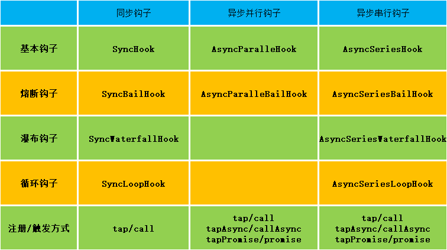

## tapable 用法详解

webpack 的插件机制是基于 tapable 库实现的，tapable 库提供了 10 种钩子函数，这里按照钩子的执行机制（并行、串行、是否熔断、是否异步、注册/触发方式）绘制了下面表格



- [tapable 用法详解](#tapable-用法详解)
  - [SyncHook 钩子](#synchook-钩子)
  - [SyncBailHook](#syncbailhook)
  - [SyncWaterfallHook](#syncwaterfallhook)
  - [SyncLoopHook](#syncloophook)
  - [AsyncParallelHook](#asyncparallelhook)
  - [AsyncParallelBailHook](#asyncparallelbailhook)
  - [AsyncSeriesHook](#asyncserieshook)
  - [AsyncSeriesBailHook](#asyncseriesbailhook)
  - [AsyncSeriesWaterfallHook](#asyncserieswaterfallhook)
  - [AsyncSeriesLoopHook](#asyncseriesloophook)
  - [拦截器](#拦截器)


### SyncHook 钩子

执行机制：钩子被触发后，按照钩子函数的注册顺序依次**同步执行**

```js
const { SyncHook } = require('tapable')

const hook = new SyncHook(['params'])

hook.tap('event1', (params) => {
  console.log('执行了event1', params)
})

hook.tap('event2', (params) => {
  setTimeout(() => {
    console.log('执行了event2', params)
  }, 1000)
})

hook.tap('event3', (params) => {
  console.log('执行了event3', params)
  return 1
})

hook.call(100)

// 执行了event1 100
// 执行了event3 100
// 执行了event2 100
```

### SyncBailHook

执行机制：`SyncBailHook` 钩子被触发后，执行顺序与基本类型钩子一致，不同的是其加了一层保险逻辑，即如果任意一个钩子函数的返回值为非 undefined，整个钩子的执行过程会立即中断，之后注册的钩子函数将不会再执行

```js
const { SyncBailHook } = require('tapable')

const hook = new SyncBailHook(['params'])

hook.tap('event1', (params) => {
  console.log('执行了event1', params)
})

hook.tap('event2', (params) => {
  setTimeout(() => {
    console.log('执行了event2', params)
  }, 1000)
  return 1
})

hook.tap('event3', (params) => {
  console.log('执行了event3', params)
})

hook.call(100)
// 执行了event1 100
// 执行了event2 100
```

可以看到 event2 的钩子函数返回了 1，在之后注册的 event3 钩子函数就不生效了

### SyncWaterfallHook

执行机制：`SyncBailHook` 钩子被触发后，执行顺序与基本类型钩子一致，不同的是其关注钩子函数的返回值，**会依次传递函数的返回值给下一个钩子函数**

```js
const { SyncWaterfallHook } = require('tapable')

const hook = new SyncWaterfallHook(['params'])

hook.tap('event1', (params) => {
  console.log('执行了event1', params)
  return params + 1
})

hook.tap('event2', (params) => {
  setTimeout(() => {
    console.log('执行了event2', params)
  }, 1000)
  return params + 2
})

hook.tap('event3', (params) => {
  console.log('执行了event3', params)
})

hook.call(100)

// 执行了event1 100
// 执行了event3 103
// 执行了event2 101
```

### SyncLoopHook

执行机制：`SyncLoopHook` 钩子被触发后，执行顺序与基本类型钩子一致，不同的是如果任意一个钩子函数的返回值为非 undefined，那么会立即重新从头开始执行所有的钩子函数，直到所有钩子函数的返回值都为 undefined

如果返回 undefined 则表示退出循环

```js
const { SyncLoopHook } = require('tapable')

const hook = new SyncLoopHook(['params'])

let total1 = 0,
  total2 = 0

hook.tap('event1', (params) => {
  if (total1 < 4) {
    console.log('执行了event1', total1)
    total1++
    return 1
  }
  return undefined
})

hook.tap('event2', (params) => {
  if (total2 < 3) {
    console.log('执行了event2', total2)
    total2++
    return 1
  }
  return undefined
})

hook.call(100)

// 执行了event1 0
// 执行了event1 1
// 执行了event1 2
// 执行了event1 3
// 执行了event2 0
// 执行了event2 1
// 执行了event2 2
```

### AsyncParallelHook

执行机制：`AsyncParallelHook` 钩子被触发后，**并发**执行所有注册的异步钩子函数，所有钩子函数执行完毕后，执行最终的回调函数，这也是同步钩子与异步钩子的区别

```js
const { AsyncParallelHook } = require('tapable')

const hook = new AsyncParallelHook(['params'])

console.time('timer')

hook.tapPromise('event1', (params) => {
  console.log(`执行了event1 params => ${params}`)
  return new Promise((resolve, reject) => {
    resolve(1)
  })
})

hook.tapPromise('event2', (params) => {
  console.log(`执行了event2 params => ${params}`)
  return new Promise((resolve, reject) => {
    setTimeout(() => {
      reject(2)
    }, 2000)
  })
})

hook
  .promise(100)
  .then((res) => {
    console.log('res', res)
  })
  .catch((err) => {
    console.timeEnd('timer')
    console.log('err', err)
  })

// 执行了event1 params => 100
// 执行了event2 params => 100
// timer: 2.008s
// err 2
```

### AsyncParallelBailHook

执行机制：`AsyncParallelBailHook` 钩子被触发后，并行执行所有注册的异步钩子函数，如果任意一个钩子函数的返回值为非 undefined，整个钩子的执行过程会立即中断，并立马执行最终的回调函数。

熔断之前启动的钩子函数会继续执行完毕。

```js
const { AsyncParallelBailHook } = require('tapable')

const hook = new AsyncParallelBailHook(['params'])

console.time('timer')

hook.tapPromise('event1', (params) => {
  console.log(`执行了event1 params => ${params}`)
  return new Promise((resolve, reject) => {
    resolve(1)
  })
})

hook.tapPromise('event2', (params) => {
  console.log(`执行了event2 params => ${params}`)
  return new Promise((resolve, reject) => {
    setTimeout(() => {
      reject(2)
    }, 2000)
  })
})

hook
  .promise(100)
  .then((res) => {
    console.timeEnd('timer')
    console.log('res', res)
  })
  .catch((err) => {
    console.timeEnd('timer')
    console.log('err', err)
  })

// 执行了event1 params => 100
// 执行了event2 params => 100
// timer: 13.956ms
// res 1
```

### AsyncSeriesHook

执行机制：`AsyncSeriesHook` 钩子被触发后，**串行**执行所有注册的异步钩子函数，所有钩子函数执行完毕后，执行最终的回调函数

```js
const { AsyncSeriesHook } = require('tapable')

const hook = new AsyncSeriesHook(['params'])

console.time('timer')

hook.tapPromise('event1', (params) => {
  console.log(`执行了event1 params => ${params}`)
  return new Promise((resolve, reject) => {
    setTimeout(() => {
      resolve(1)
    }, 1000)
  })
})

hook.tapPromise('event2', (params) => {
  console.log(`执行了event2 params => ${params}`)
  return new Promise((resolve, reject) => {
    setTimeout(() => {
      reject(2)
    }, 2000)
  })
})

hook
  .promise(100)
  .then((res) => {
    console.timeEnd('timer')
    console.log('res', res)
  })
  .catch((err) => {
    console.timeEnd('timer')
    console.log('err', err)
  })

// 执行了event1 params => 100
// 执行了event2 params => 100
// timer: 3.011s
// err 2
```

### AsyncSeriesBailHook

执行机制：`AsyncSeriesBailHook` 钩子被触发后，串行执行所有注册的异步钩子函数，如果任意一个钩子函数的返回值为非 undefined，整个钩子的执行过程会立即中断，并立马执行最终的回调函数，熔断之后注册的钩子函数将不会再执行

```js
const { AsyncSeriesBailHook } = require('tapable')

const hook = new AsyncSeriesBailHook(['params'])

console.time('timer')

hook.tapPromise('event1', (params) => {
  console.log(`执行了event1 params => ${params}`)
  return new Promise((resolve, reject) => {
    setTimeout(() => {
      resolve(1)
    }, 1000)
  })
})

hook.tapPromise('event2', (params) => {
  console.log(`执行了event2 params => ${params}`)
  return new Promise((resolve, reject) => {
    setTimeout(() => {
      reject(2)
    }, 2000)
  })
})

hook
  .promise(100)
  .then((res) => {
    console.timeEnd('timer')
    console.log('res', res)
  })
  .catch((err) => {
    console.timeEnd('timer')
    console.log('err', err)
  })

// 执行了event1 params => 100
// timer: 1.009s
// res 1
```

### AsyncSeriesWaterfallHook

执行机制：`AsyncSeriesWaterfallHook` 钩子被触发后，串行执行所有注册的异步钩子函数，会依次传递函数的返回值给下一个钩子函数，并最终执行回调函数

```js
const { AsyncSeriesWaterfallHook } = require('tapable')

const hook = new AsyncSeriesWaterfallHook(['params'])

console.time('timer')

hook.tapPromise('event1', (params) => {
  console.log(`执行了event1 params => ${params}`)
  return new Promise((resolve, reject) => {
    setTimeout(() => {
      resolve(params + 1)
    }, 1000)
  })
})

hook.tapPromise('event2', (params) => {
  console.log(`执行了event2 params => ${params}`)
  return new Promise((resolve, reject) => {
    setTimeout(() => {
      reject(2)
    }, 2000)
  })
})

hook
  .promise(100)
  .then((res) => {
    console.timeEnd('timer')
    console.log('res', res)
  })
  .catch((err) => {
    console.timeEnd('timer')
    console.log('err', err)
  })

// 执行了event1 params => 100
// 执行了event2 params => 101
// timer: 3.009s
// err 2
```

### AsyncSeriesLoopHook

执行机制：`AsyncSeriesLoopHook` 钩子被触发后，串行执行所有注册的异步钩子函数，如果钩子函数的返回值不是 undefined 就会一直重新执行钩子函数

```js
const { AsyncSeriesLoopHook } = require('tapable')

const hook = new AsyncSeriesLoopHook(['params'])

console.time('timer')

let total1 = 0

hook.tapPromise('event1', (params) => {
  console.log(`执行了event1 params => ${params}`)
  return new Promise((resolve, reject) => {
    setTimeout(() => {
      if (total1 < 2) {
        resolve(params + 1)
        total1++
      } else {
        resolve()
      }
    }, 1000)
  })
})

hook.tapPromise('event2', (params) => {
  console.log(`执行了event2 params => ${params}`)
  return new Promise((resolve, reject) => {
    setTimeout(() => {
      reject(2)
    }, 2000)
  })
})

hook
  .promise(100)
  .then((res) => {
    console.timeEnd('timer')
    console.log('res', res)
  })
  .catch((err) => {
    console.timeEnd('timer')
    console.log('err', err)
  })

// 执行了event1 params => 100
// 执行了event1 params => 100
// 执行了event1 params => 100
// 执行了event2 params => 100
// timer: 5.012s
// err 2
```

### 拦截器

tapable 提供的所有 Hook 都支持注入 Interception，它和 Axios 中的拦截器的效果非常类似

```js
const { AsyncSeriesHook } = require('tapable')

const hook = new AsyncSeriesHook(['params'])
console.time('timer')

hook.intercept({
  // 每次调用 hook 实例的 tap() 方法注册回调函数时, 都会调用该方法
  register: (tapInfo) => {
    console.log('注册了', tapInfo.name)
    return tapInfo
  },
  // 调用 hook 实例对象上的 call 方法时触发
  call: (params) => {
    console.log('获取参数', params)
  },
  // 调用被注册的每一个事件函数之前执行
  tap: (tap) => {
    console.log('tap', tap)
  },
  loop: (...args) => {
    console.log('loop', args)
  },
})

hook.tapAsync('event1', (params, callback) => {
  console.log(`执行了event1 params => ${params}`)
  callback()
})

hook.tapAsync('event2', (params, callback) => {
  console.log(`执行了event2 params => ${params}`)
  setTimeout(() => {
    callback()
  }, 2000)
})

hook.callAsync(100, (err) => {
  console.timeEnd('timer')
  if (err) {
    console.log('发生了错误', err)
    return
  }
  console.log('执行完成')
})

// 注册了 event1
// 注册了 event2
// 获取参数 100
// tap { type: 'async', fn: [Function (anonymous)], name: 'event1' }
// 执行了event1 params => 100
// tap { type: 'async', fn: [Function (anonymous)], name: 'event2' }
// 执行了event2 params => 100
// timer: 2.012s
// 执行完成
```
