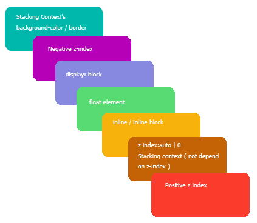

# 分享一些比较少见但有用的CSS属性


- [分享一些比较少见但有用的CSS属性](#分享一些比较少见但有用的css属性)
  - [will-change](#will-change)
    - [Web 页面展示过程](#web-页面展示过程)
    - [浏览器渲染原理](#浏览器渲染原理)
    - [节点（Nodes）和渲染对象（Render Object）](#节点nodes和渲染对象render-object)
    - [渲染对象（RenderObjects）和渲染图层（Paint Layer）](#渲染对象renderobjects和渲染图层paint-layer)
    - [PaintLayers 与 GraphicsLayers 的关系](#paintlayers-与-graphicslayers-的关系)
    - [CSS在浏览器渲染层面承担了怎样的角色](#css在浏览器渲染层面承担了怎样的角色)
    - [渲染层提升为合成层的方式](#渲染层提升为合成层的方式)
    - [提升合成层的优缺点](#提升合成层的优缺点)
      - [优点](#优点)
      - [缺点](#缺点)
  - [display 的几种值](#display-的几种值)
    - [flow-root](#flow-root)
    - [table-cell](#table-cell)
  - [caret-color](#caret-color)
  - [scroll-behavior](#scroll-behavior)
  - [:target](#target)
  - [:focus-within](#focus-within)
  - [:placeholder-shown](#placeholder-shown)
  - [@supports](#supports)
  - [attr()](#attr)
  - [aspect-ratio](#aspect-ratio)
  - [contain](#contain)

## will-change

MDN 上的解释是：

CSS 属性 will-change 为 web 开发者提供了一种告知浏览器该元素会有哪些变化的方法，这样浏览器可以在元素属性真正发生变化之前提前做好对应的优化准备工作。
这种优化可以将一部分复杂的计算工作提前准备好，使页面的反应更为快速灵敏。

### Web 页面展示过程

首先，我们需要了解一下浏览器的页面展示过程

  


- Javascript：一般来说，我们会使用 JavaScript 来实现一些视觉变化的效果。比如做一个动画或者往页面里添加一些 DOM 元素等。 
- Style: 根据 CSS 选择器，对每个 DOM 元素匹配对应的 CSS 样式。
- Layout: 具体计算 DOM 元素显示在屏幕上的大小及位置。
- Paint: 实现一个 DOM 元素的可视效果(颜色、边框、阴影等)
- Composite: 渲染层合并，当每个层绘制完成后，浏览器会将所有层按照合理顺序合并为一个图层，显示到屏幕。


### 浏览器渲染原理

在讨论 **Composite** 之前，我们还需要了解一下浏览器渲染原理

  


  


### 节点（Nodes）和渲染对象（Render Object）

DOM 树中每个可以显示的节点（Node），都对应一个渲染对象（Render Object），渲染对象被存储在一个有层级的树形结构中，叫做渲染对象树（Render Tree）。

某些情况下 Webkit 需要建立匿名的 RenderObject 节点，这样的节点不对应于 DOM 树中的任何节点，而是 Webkit 处理上的需要，典型的例子就是匿名用于表示块元素的 RenderBlock 节点。

**DOM** 元素与 **Layout Object** 不是一一对应的关系


### 渲染对象（RenderObjects）和渲染图层（Paint Layer）

每个渲染对象（RenderObject）都有其对应的渲染图层（Paint Layer）。通过直接关联或者是通过其根对象（其根级 RenderObject）间接关联。

一般来说，拥有相同 **z 坐标空间** 的的渲染对象会属于同一个渲染图层。Paint Layer 最初是用来实现stacking context（层叠上下文），用来保证页面元素以正确的顺序合成。

**拥有层叠上下文属性的元素会生成一个新的层叠上下文对象，每个层叠上下文对象都是一个渲染图层。**

渲染层可以分为 3 类，各个渲染层的主要形成原因如下所示：

1. **kNormalPaintLayer**

- 根元素（HTML）
- position 值为 absolute 或 relative，且 z-index 不为 auto 的元素
- position 值为 fixed 或 sticky 的元素
- flex 容器的子元素，且 z-index 值不为 auto
- grid 容器的子元素，且 z-index 值不为 auto
- mix-blend-mode 属性值不为 normal 的元素
- 以下任意属性值不为 none 的元素（transform、filter、perspective、clip-path、mask/mask-image/mask-border、isolation 属性值为 isolate 的元素）

2. **kOverflowClipPaintLayer** 
- overflow 不为 visible

3. **KNoPaintLayer**
- 不需要 paint 的 PaintLayer，比如一个没有视觉属性（背景、颜色、阴影等）的空 div

某些特殊的 **Paint Layer** 会被提升为 **GraphicsLayers** (合成层/复合层)。

**渲染图层（Paint Layer）和渲染对象（RenderObject）不是一一对应的关系，而是一对多的关系。**


### PaintLayers 与 GraphicsLayers 的关系

每个 GraphicsLayer 都有一个 GraphicsContext，用于为该 GraphicsLayer 开辟一段位图，也就意味着每个 GraphicsLayer 都拥有一个独立的位图，GraphicsLayer 负责将自己的 PaintLayer 及其包含的 RenderObject 绘制到位图里，位图是存储在共享内存中，作为纹理上传到 GPU 中，最后由 GPU 将多个位图进行合成，然后画到屏幕上。

合成层上的多个渲染层（也就是多个层叠上下文）按照既定的规则进行有顺序的渲染，如下图所示：

  

我们会首先去渲染根层叠上下文，随后再去绘制负 z-index 的层叠上下文，其次是一些布局元素，例如 float，块级元素等，随后是正 z-index 以及行内元素(因为内容是最重要的，是需要被用戶看⻅的)。

 


### CSS在浏览器渲染层面承担了怎样的角色

大多数人对于CSS3的第一印象，就是可以通过 **3D（如transform）** 属性来开启硬件加速，许多同学在重构某一个项目时，考虑到动画性能问题，都会倾向将 2D 属性改为 3D 属性，但开启硬件加速的底层原理其实就在于将 **PaintLayer** 提升到了 **GraphicsLayers**


### 渲染层提升为合成层的方式

- 3D 属性开启硬件加速（3d-transform）
- will-change：（opacity、transform、top、left、bottom、right），其中 top、bottom 等属性需要设置明确的定位属性，如 relative 
- 使用 fixed 或 sticky 定位
- 对 opacity、transform、fitler 应用了 animation（actived）或者 transform（actived），animation 和 transform 需要是激活状态的才行


### 提升合成层的优缺点

#### 优点

- 合成层的位图，会交给 GPU 合成，比 CPU 处理要快
- 当需要 repaint 时，只需要 repaint 本身，不会影响到其他的层，使页面更加流畅
- 对于 transform 和 opacity 效果，部分浏览器不会触发 Layout 和 Paint

#### 缺点

- 创建一个新的合成层并不是免费的，它得消耗额外的内存和管理资源
- 纹理上传后交由 GPU 处理，因此我们还需要考虑 CPU 和 GPU 之间的带宽问题，以及有多大内存供 GPU 处理这些纹理的问题

chrome://tracing


## display 的几种值

### flow-root

可以让元素拥有块级作用域，也就是 BFC。

兼容性：

[caniuse](https://caniuse.com/flow-root)

  


### table-cell

可以给出类似于 table 标记的子元素的样式。

使用方法：基本上都是在父元素上使用 display: table ; 然后使用 table-cell

  


  

## caret-color

caret-color 可以设置插入符号的颜色，即下一个字符的可见标记，也称为文本输入光标。
插入符号出现在诸如 input 或者具有 contenteditable 属性的元素中。

  

## scroll-behavior

当用户手动导航或者 CSSOM scrolling API 触发滚动操作时，CSS 属性 scroll-behavior 为滚动框执行滚动行为。
那些由于用户行为而产生的的滚动，不受这个属性的影响。

  


## :target

:target 伪类可以让我们不使用任何 JavaScript 代码，只使用 :target 伪类创建一个弹窗。该技术依赖于初始化时就隐藏在页面中的链接到指定元素的锚。一旦定位，CSS 就会更改其 display 以便显示他们。

  


## :focus-within

:focus-within 是一个 CSS 伪类，表示一个元素获得焦点或者该元素的后代获得焦点。换句话说，元素本身或者它的后代匹配 :focus 伪类。

该选择器非常实用。举个通俗的例子：表单中的某个 **input** 字段获得焦点时，整个表单的 **form** 元素都可被高亮。

  


## :placeholder-shown

:placeholder-shown CSS 伪类 在 input 或 textarea 元素显示 placeholder text 时生效

  

## @supports

@support 由一组样式声明和一条支持条件构成。
允许在使用之前检查浏览器是否支持特定属性或属性（属性/值组合）

```css
/* check support for `grid` and `image-rendering` properties */
@supports (display: grid) {
  section {
    display: grid;
  }
}

@supports (image-rendering) {
  img {
    image-rendering: pixelated;
  }
}
```

  


## attr()

attr() 理论上能用于所有的 CSS 属性。
但目前支持的仅有伪元素的 content 属性，其他的属性和高级特性都是实验性的。

  


## aspect-ratio    

https://developer.mozilla.org/zh-CN/docs/Web/CSS/aspect-ratio
https://www.smashingmagazine.com/2019/03/aspect-ratio-unit-css/

## contain

https://developer.mozilla.org/zh-CN/docs/Web/CSS/contain

https://web.dev/quintoandar/
https://www.smashingmagazine.com/2020/03/setting-height-width-images-important-again/


