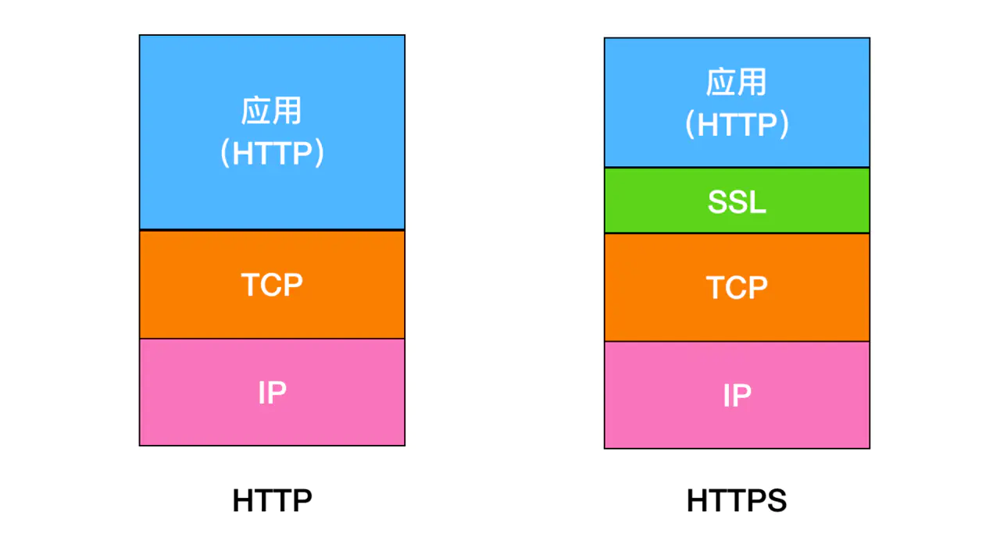
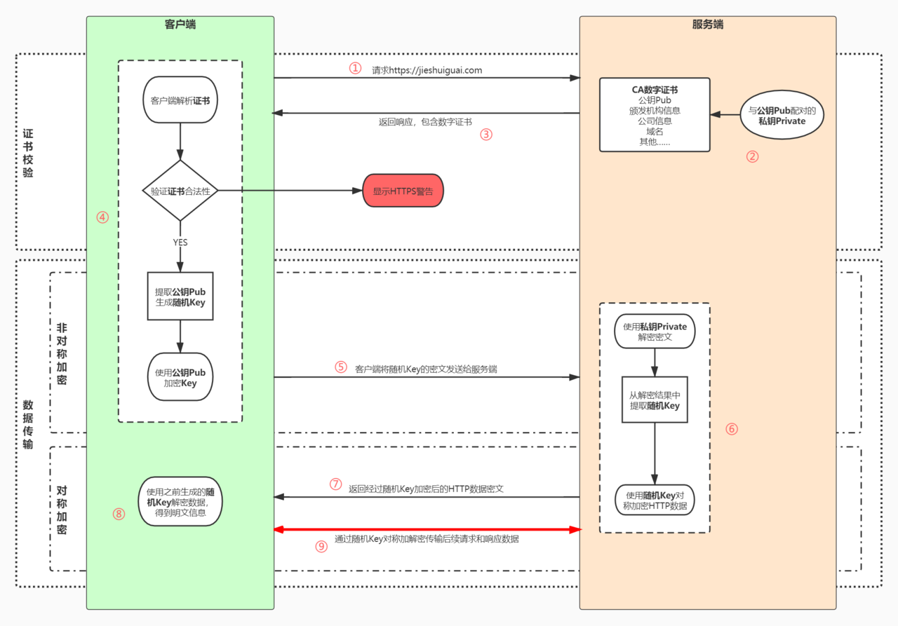
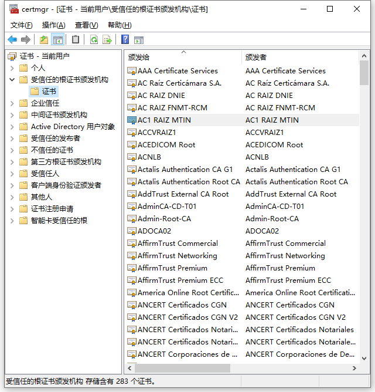

## HTTPS详解

### 什么是HTTPS

HTTP（Hypertext Transfer Protocol）超文本传输协议，是一种用于分布式、协作式和超媒体信息系统的应用层协议。

但是HTTP有一个致命缺陷，就是内容是明文传输的，没有经过任何加密，而这些明文数据会经过WIFI、路由器、运营商、机房等物理节点，如果在这中间任意一个节点被监听，传输的内容就会完全暴露，这一攻击手法叫做MITM （Man in The Middle）中间人攻击。

为了解决 HTTP 明文传输数据可能导致的安全问题，1994年网景公司提出了 HTTPS 超文本传输安全协议，数据通信仍然是HTTP，但是利用了 SSL/TSL 加密数据包。

HTTPS协议提供了3个关键的指标

- 加密（Encryption），HTTPS 通过对数据加密来使免受窃听者对数据的监听，这就意味着当用户在浏览网站时，没有人能够监听他喝网站之间的信息交换，从而窃取用户的信息
- 数据一致性（Data interity），数据在传输的过程中不会被窃听者所修改，用户发送的数据会完整的传输到服务端，保证用户发的是什么，服务器接收的就是什么
- 身份认证（Authentication），是指确认对方的真实身份，可以防止中间人攻击并建立用户信任。

HTTPS 的内核是 HTTP，也就是说 HTTPS 就是加了 **TSL/SSL** 协议的 HTTP。

  

### HTTPS 实现原理

  

HTTPS加解密过程

1. 用户在浏览器发起HTTPS请求（如 https://baidu.com ），默认使用服务端的443端口进行连接
2. HTTPS需要使用一套**CA数字证书**，证书内会附带一个**公钥Pub**，而与之对应的**私钥Private**保留在服务端不公开
3. 服务端收到请求，返回配置好的包含**公钥Pub**的证书给客户端
4. 客户端收到证书，校验合法性，主要包括是否在有效期内、证书的域名与请求的域名是否匹配，上一级证书是否有效（递归判断，直到判断到系统内置或浏览器配置好的根证书），如果不通过，则显示 HTTPS 警告信息，如果通过则继续
5. 客户端生成一个用于对称加密的**随机Key**，并用证书内的**公钥Pub**进行加密，发送给服务端
6. 服务端收到**随机Key**的密文，使用与**公钥Pub**配对的**私钥Private**进行解密，得到客户端真正想发送的随机Key
7. 服务端使用客户端发送过来的**随机Key**对要传输的 HTTP 数据进行对称加密，将密文返回客户端
8. 客户端使用**随机Key**对称解密密文，得到 HTTP 数据明文
9. 后续 HTTPS 请求使用之前交换好的**随机Key**进行对称加解密

### HTTPS 如何防止中间人冒充

**CA机构和证书的作用就是为了防止中间人冒充。**

出现这一问题的核心原因是客户端无法确认收到的公钥是不是真的是服务端发来的。为了解决这个问题，会联网引入了一个公信结构，这就是 CA 结构。

服务端在使用 HTTPS 前，去经过认证的 CA 机构申请颁发一份数字证书，数字证书里包含有证书持有者、证书有效期、公钥等信息，服务端将证书发送给客户端，客户端校验证书身份和要访问的网站身份确实一致后再进行后续的加密操作。

但是，如果中间人也聪明一点，只改动了证书中的公钥部分，客户端依然不能确认证书是否被篡改？
这时我们就需要一些防伪技术了。

私钥除了解密外的真正用途其实还有一个，就是数字签名，其实就是一种防伪技术，只要有人篡改了证书，那么数字签名必然校验失败。具体过程如下：

1.	CA 机构拥有自己的一对公钥和私钥
2.	CA 机构在颁发证书时对证书明文信息进行哈希
3.	将哈希值用私钥进行加签，得到数字签名 Sign1

客户端收到服务端发来的数字证书后，浏览器本身会保存着 CA 机构的根证书（CA 机构的公钥），然后

1.	客户端得到证书，分解得到证书的明文信息和数字签名 Sign1
2.	通过 CA 机构的公钥对数字签名解签，得到 Sign2
3.	通过数字证书的哈希算法对明文信息进行哈希得到一个哈希值
4.	将这个哈希值与解签后的 Sign2 相等，就证明没有被篡改

证书的数字签名是CA机构的私钥加签生成的，所以中间人无法造假证书。

  
