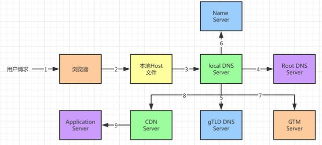

## 简述DNS及其作用

### 什么是DNS

DNS 即 Domain Name System ，即域名系统。DNS 是因特网上作为域名和 IP 地址相互映射的一个分布式数据库，能够使用户信息更方便的去访问互联网而不是去记住能够被机器直接读取的IP地址。

DNS 是一个由分层的 DNS 服务器（DNS Server）实现的分布式数据库。DNS 服务器通常是运行BIND（Berkeley Internet Name Domain）软件的 UNIX 机器。
DNS 是一个使得主机能够查询分布式数据库的应用层协议。DNS 协议运行在 UDP 之上，使用的是 53 号端口。
通过域名，最终得到该域名对应的 IP 地址的过程是域名解析的过程。

当我们在浏览器上输入请求URL（www.baidu.com）时会发生什么现象？一般的做法如下

1. 我们的主机上运行着 DNS 应用的客户端
2. 浏览器从上述URL中抽取主机名 www.baidu.com ，并将这台主机名发送给 DNS 应用的客户端。
3. DNS 客户端向 DNS 服务器发送一个包含主机名的请求。所有的 DNS 请求和回答报文使用 UDP 数据报经 53 端口发送。
4. DNS 客户端最终会收到一份回答报文，其中包含对应于该主机名的IP地址。
5. 一旦浏览器接收到来自 DNS 的该 IP 地址，它能够向位于该 IP 地址 80 端口（HTTP请求）的HTTP 服务器进程发送一个 TCP 连接

windows10 上的 DNS 应用为 DNS Client

  

DNS Client 的意思是客户机域名解析服务。

为了达到用最快速、最有效率的方式，让客户端能够迅速找到网域的验证服务，当在系统中加入了 DNS 快取（Cache）的功能时，第一次在找到了目的主机的 IP 地址后，操作系统就会将所查询到的名称及 IP 地址记录在本机的 DNS 快取缓冲区中，当下次客户端还需要再查询时，就无需再到 DNS 服务器上查询，而直接使用本机 DNS Cache 中的数据即可。


### DNS服务器的层级结构

为了处理 DNS 拓展性问题，DNS 使用了大量的DNS服务器，他们以层次方式组织，并且分布在世界各地。没有一台 DNS 服务器拥有因特网上所有主机的映射。

大致来说，有 3 种类型的 DNS 服务器：

- 根 DNS 服务器：有400多个根名字服务器遍布全球。根 DNS 服务器提供顶级域名服务器的 IP 地址。
- 顶级域名服务器：顶级域名服务器提供了权威 DNS 服务器的 IP 地址。
- 权威 DNS 服务器：权威 DNS 服务器提供该组织的可访问域名的 IP 地址。

结构如图所示：

  


除了这 3 种 DNS 服务器，还有另一类重要的 DNS 服务器，称为本地 DNS 服务器（上文种的DNS Client）。本地 DNS 服务器虽然不属于该服务器的层级结构，但它对 DNS 层次结构是至关重要的。

假设主机 cse.nyu.edu 想知道主机 gaia.cs.umass.edu 的IP地址。
1. 主机 cse.nyu.edu 首先向它的本地DNS服务器 dns.nyu.edu 发送一个 DNS 查询报文。DNS查询报文内封装有要查询的域名 gaia.cs.umass.edu
2. 由于假定无缓存，本地 DNS 服务器将查询报文转发到根 DNS 服务器；
3. 根 DNS 服务器注意到其edu前缀，向本地 DNS 服务器返回负责 edu 的顶级域名 DNS 服务器的 IP 地址列表；
4. 本地 DNS 服务器则再次向这些顶级域名 DNS 服务器之一发送查询报文；
5. 顶级域名DNS服务器（edu）注意到umass.edu前缀，并返回权威 DNS 服务器的 IP 地址进行应
6. 该权威DNS服务器是负责马萨诸塞大学的 dns.umass.edu；
7. 本地DNS服务器向 dns.umass.edu 发送查询报文；
8. 权威DNS服务器（dns.umass.edu）用 gaia.cs.umass.edu的 IP 地址进行响应；
9. 本地DNS服务器将 gaia.cs.umass.edu 的 IP 地址反馈给主机 cse.nyu.edu。

  


### DNS缓存

**有 DNS 的地方，就有缓存**。

实际上，为了改善时延性能并减少在因特网上到处传输的 DNS 报文数量，DNS 广泛使用了缓存技术。

DNS 缓存的原理非常简单。在一个请求链中，当某 DNS 服务器接收到了一个 DNS 回答时，它能将映射缓存在本地存储器中（**windows 系统会保存在 hosts 文件中**）。如果在 DNS 服务器缓存了一台主机名/IP地址对，另一个对相同主机名的查询到该 DNS 服务器时，该 DNS 服务器就能够提供所要求的 IP 地址，即使它不是该主机名的权威服务器。

由于主机和主机名与 IP 地址的映射不是永久的，DNS 服务器在一段时间后（通常设置为两天）将丢弃缓存的信息。

  

浏览器DNS缓存（chrome 浏览器可以通过 chrome://net-internals/?#dns 查看浏览器的 DNS 缓存） → 操作系统的hosts文件是否有映射关系（本地 DNS 缓存）→ 本地 DNS 服务器查找 DNS根服务器递归查找 → 根DNS域名服务器 → 返回顶级域名服务器地址 → 访问顶级域名服务器（TLD服务器）→ 返回 NameServer 服务器地址 → 返回指定域名的 A 记录（指定主机名或域名的IP地址）和 CNAME（别名记录）


### DNS记录和报文

上面我们说到了，DNS接收到一个DNS回答报文时，会将映射缓存在本地存储器中，那么映射之间的关系是以怎样的格式保存在报文中的呢？

共同实现DNS分布式数据库的所有DNS服务器存储了资源记录（Resource Record RR）。RR提供了主机名到IP地址的映射，每个DNS报文都包含了一条或者多条资源记录。

资源记录时一个包含了下列字段的4元组

```
(Name, Value, Type, TTL)
```
TTL是该记录的生存时间，它决定了资源记录应当从缓存中删除的时间。而Name和Value的值则取决于Type
- 当 Type=A 时。Name 是主机名，Value 是主机名对应的 IPv4 地址。
- 当 Type=AAAA 时。Name 是主机名，Value 是主机名对应的 IPv6 地址。
- 当 Type=NS 时。Name 是个域，Value 是个知道如何获得该域中主机 IP 地址的权威 DNS 服务器的主机名。
- 当 Type=CANME 时。则 Value 时别名为Name的主机对应的规范主机名。例如（foo.com, relay1.bar.foo.com, CNAME）
- 当Type=MX时，value 是别名为Name的邮件服务器的规范主机名。例如（foo.com, mail.bar.foo.com, MX）

DNS的报文格式：

  